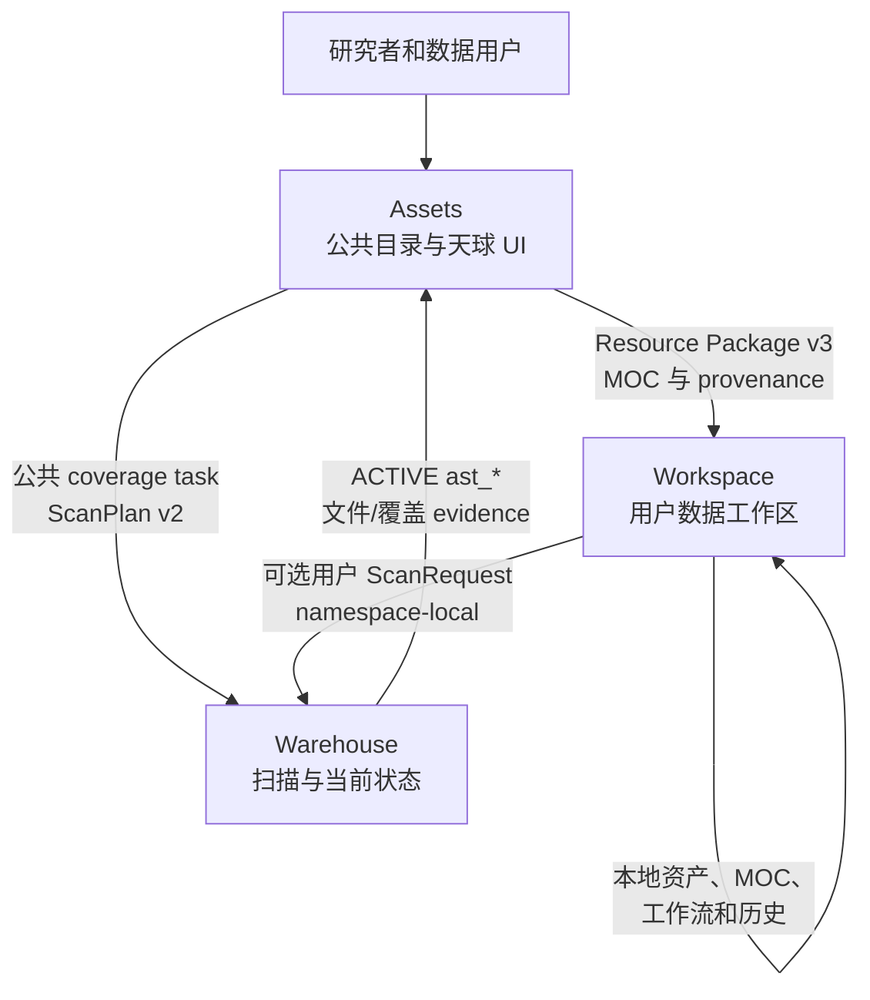
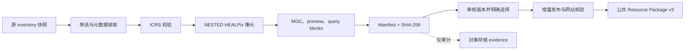

# Astro Survey Atlas

Astro Survey Atlas 是面向公开天文巡天的数据基础设施，用来回答“天空哪里有
覆盖、对应的官方数据从哪里获取”。`Assets` 仓库是面向公众的入口：发布经过
审阅的巡天元数据、ICRS/NESTED HEALPix 覆盖、重合结果、provenance 和版本化
Resource Package v3。

Assets 绝不代替用户下载科学数据。可下载的 JSON/CSV **下载计划文件**列出重合区域
关联的巡天、Tile/block/文件、来源依据和可用链接，不包含科学数据本身；用户自行在
来源系统获取数据。没有下载链接时，已有来源依据仍有价值。范围和精度规则见
[覆盖工作流](docs/coverage-workflow.md)。

本仓库属于 [Astro Survey Atlas 组织](https://github.com/Astro-Survey-Atlas)：

| 项目 | 职责 | 入口 |
| --- | --- | --- |
| [Assets](https://github.com/Astro-Survey-Atlas/Assets) | 公共巡天目录、覆盖天球、MOC、重合查询和发布制品 | [在线目录](https://astro.assets.dev.72602.space:32443/surveys/) |
| [Warehouse](https://github.com/Astro-Survey-Atlas/Warehouse) | Scanner、ScanPlan/ScanRequest 执行、当前文件/覆盖索引和 evidence | [Warehouse README](https://github.com/Astro-Survey-Atlas/Warehouse) |
| [Workspace](https://github.com/Astro-Survey-Atlas/Workspace) | 用户资产、Connector、本地工作流、用户 MOC 和私有探索 | [Workspace README](https://github.com/Astro-Survey-Atlas/Workspace) |

## 当前实现

Assets 已拆分为公开网站与单写者后台，
使用独立 release 缓存及持久化发布队列。审核后的具体产品版本走增量发布，网站
核验通过后才完成发布；完整 release 归档用于导出或恢复。Warehouse 执行状态
不会自动授予公开可见性。

MOC 探索调用 CDS；Assets 已实现可选 LLM 增强，仅在显式开启且 CDS 完整返回零候选
时触发，可用性取决于供应商配置。具体限制见增强说明。

当前部署、验收和待办见 [交接文档](HANDOFF.md)。技术详情见
[发布运行架构](docs/publication-runtime-split.md)、[当前探索](docs/deferred-moc-discovery-plan.md)
及 [增强设计](docs/moc-discovery-enhancement-design.md)。

## 三个项目如何协作



边界是刻意设计的。Assets 决定哪些结果进入公共发布并负责面向用户的展示；
Warehouse 枚举本地/S3/OSS 数据源，提取文件级空间信息并报告 `ast_*` 当前
索引状态；Workspace 在自己的数据面保存用户数据和任务历史，可以消费经过校验
的公共包，也可以选择 Warehouse 执行用户扫描，但不会把用户记录写回 Assets。



Assets 不会把 preview 当成更高精度的测量。每个响应都会返回实际 order，并标记
`exact`、`estimated`、`entrypoint-only` 或 `truncated`。在线反查有明确上限，
只读取配置的 Warehouse endpoint（`ASSETS_WAREHOUSE_ES_URL`）。

## Assets 发布什么

- `GET /api/v1/surveys` 和 `GET /api/v1/products`：已审阅的元数据和产品 dossier。
- `GET /api/v1/coverage/catalog` 及不可变 coverage blocks：天球 UI 数据。
- `POST /api/v1/coverage/overlap` 和 `/overlap/details`：公共 order 重合与连通区域。
- `POST /api/v1/coverage/reverse-lookup`：有界的文件、tile 和下载入口反查。
- Resource Package v3：MOC、公共 footprint 投影、provenance 和包说明。

[覆盖工作流](docs/coverage-workflow.md)、[API 参考](docs/api-reference.md) 和
[Resource Package 集成指南](docs/resource-package-integration.md) 定义稳定契约。
[MOC Core 契约](docs/moc-core-contract.md) 记录现有的离线
`astro-survey-moc-core` 实现；当前组织没有承诺一个通用在线 SDK。

## 公共发布与 evidence 存储

Git 保存小型、可审阅的发布元数据：survey/layer registry、recipe lock、schema、
catalog 投影、provenance 摘要和 hash。版本化 MOC、资源包和大型 evidence 由生产
S3 保存；真实 CSST 私有数据、预览和配方由 Workspace 持有，不进入 Assets Git、后台、证据存储或发布。当前 checkout 保留合成 conformance fixture、Core wheel 和
`evidence-index.json`。生成的 release、layer、raw、content、probe 和 staging 副本
已在独立 S3 恢复及 SHA-256/size 校验后删除。

详见[公共制品存储与迁移](docs/public-artifact-storage.md)，其中定义 bucket 目录、
不可变 URL/hash 契约、evidence 边界和切换流程。输入 manifest、normalized scan 等
始终属于 evidence，不会进入浏览器初始请求或公共 release allowlist。

发布同步任务和 hydrate 必须配置 S3-compatible 对象存储；新环境无法访问 S3 时
会失败关闭，不会使用源码目录或隐藏的本地 release 兜底。HTTP 请求继续读取已经
校验并激活的 `/data/current`，不在每次请求时访问 S3。请按[存储契约](docs/public-artifact-storage.md)
配置 endpoint、bucket 和 credential Secret。

## 存储权威

[S3 唯一权威实施计划](docs/s3-authority-implementation-plan.md) 记录：生产 S3
保存已上传业务数据和已同步控制状态，本地只保留可删除的恢复缓存、可重算
scratch 和独立待上传目录。已确认的 authority 是 gitignored `.info` 描述的
MinIO，不是已退役的 Helm 开发桶。P0-P6 迁移和线上消费者切换已完成；仍在使用的
PVC 按迁移收据保留，待单独完成证据化退役评估。

## 部署

服务只通过 Helm chart 部署：

```bash
helm upgrade --install astro-survey-atlas-assets \
  charts/astro-survey-atlas-assets \
  --namespace astro-survey-atlas-assets --create-namespace \
  --values <environment-values.yaml>
```

真实环境 values 保存在仓库之外；脱敏模板见
`charts/astro-survey-atlas-assets/examples/`。

## 本地开发

```bash
npm ci
npm run validate
npm start
```

服务监听 `http://127.0.0.1:4180`。测试 Warehouse 反查时设置
`ASSETS_WAREHOUSE_ES_URL`；没有该变量时，静态公共几何目录仍可使用。

网站提供独立入口：[项目总览](/github/)、[巡天目录](/surveys/) 和
[集成/SDK 状态](/sdk/)。

English version: [README.md](README.md)。

## 许可证

本仓库采用 Apache License, Version 2.0。详见 [LICENSE](LICENSE) 和
[NOTICE](NOTICE)。本项目属于 Astro Survey Atlas GitHub 组织，不是 Apache
Software Foundation 项目。
