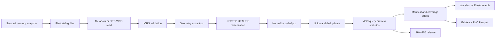
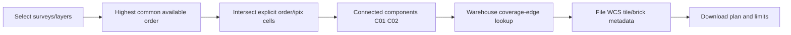

# Astro Survey Atlas Assets

Astro Survey Atlas Assets is the public, reproducible coverage service for
astronomical surveys. It publishes ICRS/NESTED HEALPix footprints, lets users
compare selected surveys at their highest common precision, and turns an
overlap into a reviewable download plan: survey/release/modality, RA/DEC
extent, source files, tile/brick identifiers and download entrypoints.

This repository is the Assets boundary. It owns release manifests, MOC/query
blocks, previews, product presentation, evidence hashes and the public API.
`data-warehouse` owns scan execution and operator status. Assets submits the
standard scan task and consumes normalized file and coverage documents.
Atlas is the user-facing visualization/client layer. Assets never depends on
Atlas internals.

## Processing model

Every survey recipe follows the same auditable forward path. The recipe lock
records the actual source snapshot, scanner run, implementation reference,
available HEALPix orders and output hashes.



The reverse path is equally fixed. It never mixes orders: an order-4-only
layer limits the result to order 4/NSIDE 16, while a layer with an order-8
scan can participate at order 8. Every response states `exact`, `estimated`,
`entrypoint-only` or `truncated` precision.



The detailed contract is in [`docs/coverage-workflow.md`](docs/coverage-workflow.md)
and [`contracts/coverage-evidence-v1.schema.json`](contracts/coverage-evidence-v1.schema.json).
The repository workflow is enforced by [`AGENTS.md`](AGENTS.md) and the
`skills/astro-survey-atlas-coverage-workflow` skill.

## Runtime and evidence

Runtime delivery is deliberately small: coverage catalog, visible HEALPix
blocks, survey catalog, published product content, previews and lightweight
metadata. Evidence delivery contains input manifests, normalized scans, task
snapshots, raw MOCs and complete provenance. Evidence is retained on the
evidence PVC/object store, downloadable and hash-verifiable, but is never an
initial browser request.

For CSST, `files.parquet` stores source file/WCS/ETag metadata and
`coverage_edges.parquet` stores the mapping from `layerId + order + ipix` to
source files. Parquet is for audit, rebuild and bulk export; online reverse
lookup uses the warehouse indices:

- `astro_file_index_v1`
- `astro_coverage_index_v1`
- `astro_object_index_v1` (when an object workflow is published)

The Assets runtime only uses `ASSETS_WAREHOUSE_ES_URL`. The historical ES URL
is accepted only by the explicit one-shot migration script.

## Public API

- `GET /api/v1/coverage/catalog` and `GET /api/v1/coverage/blocks/:layerId`
  expose catalog metadata and cached blocks.
- `POST /api/v1/coverage/overlap` computes common-order cells and C01/C02
  components.
- `POST /api/v1/coverage/reverse-lookup` returns source files, WCS bounds,
  download entrypoints and precision/limit metadata for selected cells.
- `GET /api/v1/surveys` and `GET /api/v1/products` expose the public catalog
  and published product content. Draft product content is admin-only.
- `GET /github/`, `/surveys/` and `/sdk/` are separate documentation/catalog
  pages; `/resources/` is intentionally not a route.

## Local development

```bash
npm ci
npm run build
npm test
npm start
```

The service listens on `http://127.0.0.1:4180`. Set
`ASSETS_WAREHOUSE_ES_URL` when testing file-level reverse lookup locally; the
public geometry API remains usable without it.

## Evidence migration

The source must be explicit and the target defaults to the warehouse service.
Run a dry run before importing any records:

```bash
python3 scripts/migrate_csst_evidence.py \
  --source-es-url http://legacy-es:9200 \
  --run W1=workspace-coverage-04a0be5dc49c \
  --run W2=workspace-coverage-ec9448e73ced-retry4 \
  --run W3=workspace-coverage-ee904e0f11af-retry3 \
  --run W4=workspace-coverage-dbf269d0f221-retry3 \
  --dry-run
```

Add `--evidence-dir /var/lib/assets-evidence/csst` with the `evidence` Python
extra installed to write compressed Parquet tables. The importer never copies
the historical 205 MB W1 manifest into runtime delivery.

## Build and deploy

```bash
npm run assets:build
npm run build:server
npm run build:site
helm lint charts/astro-survey-atlas-assets
helm template astro-survey-atlas-assets charts/astro-survey-atlas-assets \
  -f deploy/k3s-values.yaml
helm upgrade --install astro-survey-atlas-assets \
  charts/astro-survey-atlas-assets --namespace astro-survey-atlas-assets \
  --create-namespace -f deploy/k3s-values.yaml
```

The chart configures the warehouse Elasticsearch URL, the Assets content PVC
and the release PVC. The large CSST input manifest remains evidence storage,
not a Git-tracked homepage/runtime asset.
