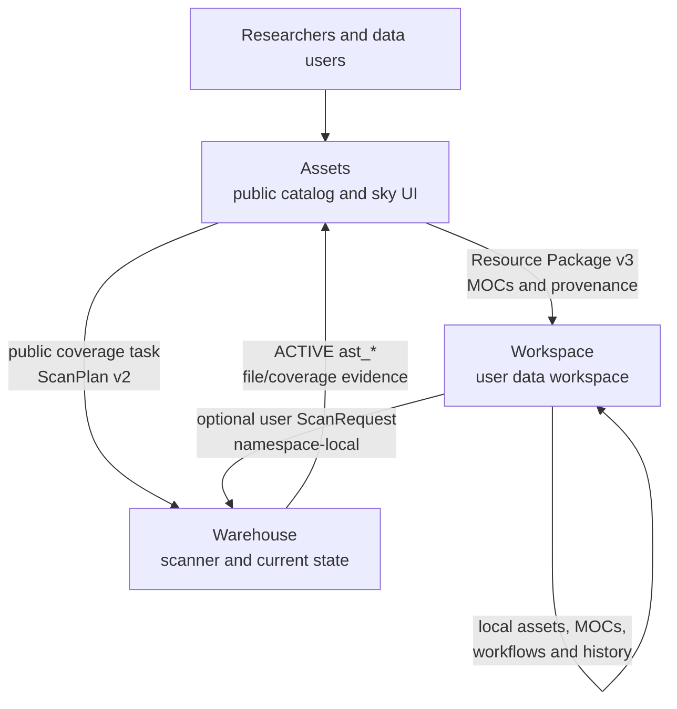
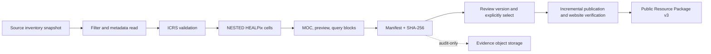

# Astro Survey Atlas

Astro Survey Atlas is an open infrastructure project for discovering where
public astronomical surveys cover the sky and how to reach the official data.
The `Assets` repository is the public front door: it publishes reviewed survey
metadata, ICRS/NESTED HEALPix coverage, overlap results, provenance and
versioned Resource Package v3 releases.

This repository is one part of the [Astro Survey Atlas organization](https://github.com/Astro-Survey-Atlas):

| Project | Role | Start here |
| --- | --- | --- |
| [Assets](https://github.com/Astro-Survey-Atlas/Assets) | Public survey directory, coverage maps, MOCs, overlap and release artifacts | [Live directory](https://astro.assets.dev.72602.space:32443/surveys/) |
| [Warehouse](https://github.com/Astro-Survey-Atlas/Warehouse) | Scanner, ScanPlan/ScanRequest execution, current file/coverage indices and evidence | [Warehouse README](https://github.com/Astro-Survey-Atlas/Warehouse) |
| [Workspace](https://github.com/Astro-Survey-Atlas/Workspace) | User assets, connectors, local workflows, user MOCs and private exploration | [Workspace README](https://github.com/Astro-Survey-Atlas/Workspace) |

## Current implementation

Verified dev checkpoint: 2026-09-20, Helm revision 182. Assets now runs a public
site and a single write-owning backend with independent release caches and a
durable publication queue. Reviewed product versions are published incrementally;
website verification completes publication. Full release archives are for export
or restore. Warehouse execution status alone never grants public visibility.

MOC discovery currently queries CDS; alias expansion and networked LLM discovery
are designed but not enabled. The Releases page shows the source-to-publication
workflow and labels the planned enhancement. Homepage modality icons follow each
survey name, with native precision beneath.

See [current handoff](HANDOFF.md), [publication runtime](docs/publication-runtime-split.md),
[current discovery](docs/deferred-moc-discovery-plan.md) and
[enhancement design](docs/moc-discovery-enhancement-design.md).

## How the projects work together



The boundaries are deliberate. Assets decides what becomes a public release
and presents the result. Warehouse enumerates configured local/S3/OSS sources,
extracts file-level spatial metadata and reports the current `ast_*` index
state. Workspace keeps user data and task history in its own data plane; it
can consume verified public packages and optionally use Warehouse for a user
scan, but it never publishes user records back to Assets.



Assets never treats a preview as a finer measurement. Each response reports
the real order and one of `exact`, `estimated`, `entrypoint-only` or
`truncated` precision. The online reverse lookup is bounded and reads only the
configured Warehouse endpoint (`ASSETS_WAREHOUSE_ES_URL`).

## What Assets publishes

- `GET /api/v1/surveys` and `GET /api/v1/products` for reviewed metadata and
  product dossiers.
- `GET /api/v1/coverage/catalog` and immutable coverage blocks for the sky UI.
- `POST /api/v1/coverage/overlap` and `/overlap/details` for common-order
  intersections and connected regions.
- `POST /api/v1/coverage/reverse-lookup` for bounded file, tile and download
  entrypoint matches.
- Resource Package v3 archives containing MOCs, a public footprint projection,
  provenance and a package README.

The [coverage workflow](docs/coverage-workflow.md),
[API reference](docs/api-reference.md) and [Resource Package integration guide](docs/resource-package-integration.md)
define the stable contracts. The [MOC Core contract](docs/moc-core-contract.md)
documents the existing offline `astro-survey-moc-core` implementation; the
organization does not currently promise a general-purpose online SDK.

## Public release and evidence storage

Git is the source of truth for small, reviewable release metadata: survey and
layer registries, recipe locks, schemas, catalog projections, provenance
summaries and hashes. Production S3 stores versioned MOCs, packages and large
evidence. The current checkout retains only three CSST conformance fixtures, the
Core wheel and `evidence-index.json`; generated release, layer, raw, content,
probe and staging copies were removed after independent S3 restore and exact
SHA-256/size checks.

See [Public artifact storage and migration](docs/public-artifact-storage.md)
for the bucket layout, immutable URL/hash contract, evidence boundary and
cutover procedure. In particular, input manifests and normalized scans remain
evidence and are never part of the browser's initial request or the public
release allowlist.

The release sync job and hydrate command require a configured S3-compatible
object store. A fresh environment fails closed when S3 is unavailable; it does
not fall back to source-tree artifacts or hidden local release data. HTTP serves
the verified `/data/current` release without reading S3 per request. Configure
the endpoint, bucket and credential Secret as described in the storage contract.

## Storage migration target

The [S3 authority implementation plan](docs/s3-authority-implementation-plan.md)
records production S3 as the sole authority for uploaded business data and
synced control state, with disposable local caches and separate pending
uploads. The confirmed authority is the MinIO described by gitignored `.info`,
not the currently deployed Helm public bucket. P0-P6 migration and online
consumer cutover are complete; active PVCs remain under the migration receipt
until separately retired.

## Deployment

The service is deployed exclusively through the Helm chart:

```bash
helm upgrade --install astro-survey-atlas-assets \
  charts/astro-survey-atlas-assets \
  --namespace astro-survey-atlas-assets --create-namespace \
  --values <environment-values.yaml>
```

Keep real environment values outside this repository; sanitized templates are
provided under `charts/astro-survey-atlas-assets/examples/`.

## Local development

```bash
npm ci
npm run validate
npm start
```

The service listens on `http://127.0.0.1:4180`. Set
`ASSETS_WAREHOUSE_ES_URL` when testing Warehouse-backed reverse lookup; the
static public geometry catalog remains usable without it.

The site has separate entry points for the [project overview](/github/),
[survey directory](/surveys/) and [integration/SDK status](/sdk/).

中文说明见 [README.cn.md](README.cn.md)。

## License

This repository is licensed under the Apache License, Version 2.0. See
[LICENSE](LICENSE) and [NOTICE](NOTICE). It is part of the Astro Survey Atlas
GitHub organization and is not an Apache Software Foundation project.
