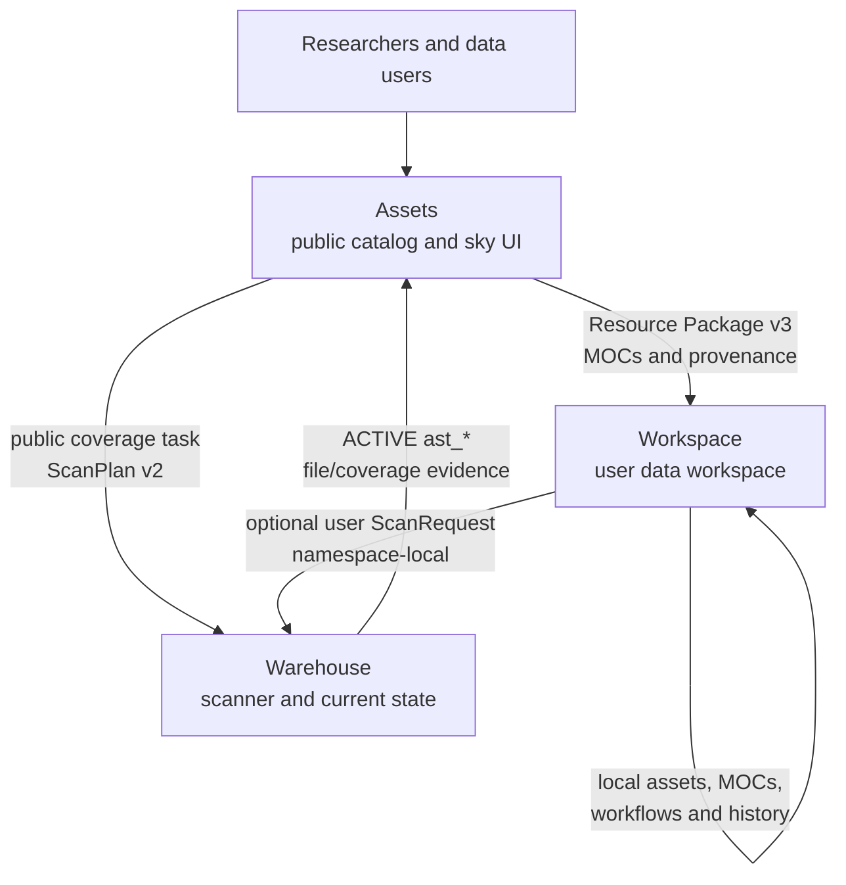
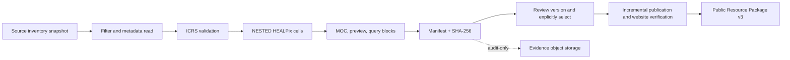

# Astro Survey Atlas

## Find survey data for your patch of sky

Load Euclid, DESI, Legacy Surveys, Gaia DR3 and HST on one sky. Compare releases
and modalities, inspect overlap, find the native Tile, brick, partition, target
or observation links, and export the same results as a JSON/CSV source manifest.
HSC-SSP also provides its existing tract/patch adapter.

**[Open Sky Atlas](https://astro.assets.72602.space/atlas/)** ·
[Browse surveys](https://astro.assets.72602.space/surveys/) ·
[Explore the API](https://astro.assets.72602.space/api-docs/)

1. Open the survey layers and choose releases and products. An ordinary
   HEALPix click lists the covering releases and modalities.
2. Press **G** to compare survey overlap, then click a connected component.
   Lookup submits the whole component up to 4,096 cells. Larger regions are
   queried as bounded pages of at most 64 cells / 100 square degrees per
   subquery, with up to 32 subqueries advanced by each page request.
3. Inspect the native unit IDs, modality, actual order, precision and source
   links. Export the displayed results as JSON or CSV. Anonymous preview is
   limited; full lookup, continued browsing and complete export require a
   `region:query` API Key. Source archives apply their own access policies.

Assets publishes reviewed survey metadata, ICRS/NESTED HEALPix coverage,
overlap, provenance and versioned Resource Package v3 releases. The public
HEALPix API provides another way to obtain published cells at supported orders.

Assets never downloads scientific data on users’ behalf. Its downloadable
JSON/CSV **download plan** lists the surveys, Tile/block/file identities,
source evidence and available links associated with an overlap region; it
contains no scientific data. Users obtain that data from the source. Known
source evidence remains useful without a download link. See the
[coverage workflow](docs/coverage-workflow.md) for the scope and precision rules.

The current product and native-unit mappings have explicit source limits. A
listed product is not proof that every file or public archive product has been
indexed; source files remain at their archive under its access policy.

| Survey | Native units and access | Captured scope |
| --- | --- | --- |
| Euclid | Q1 Tile IDs and ESA product URIs; ERO target/package links | Q1 contains 2,908 BGSUB metadata rows / 352 Tiles. Proxied GETs on 2026-10-10 returned HTTP 200 and directory listings for the VIS/NISP paths of Tile `102018211`. The listing is only an access hint; Tile membership and footprints come from locked ESA metadata, and individual science files were not checked. Other mirror paths are unverified. ERO target extents are estimated and have no verified Tile roster. See the [bounded audit](docs/research/casdc-mirror-index-audit-20261009.md). |
| DESI DR1/EDR | Estimated Tile candidates and official directories | Proxied GETs on 2026-10-10 returned HTTP 200 for the CASDC DR1, iron and zcatalog directories; the sibling `iron/tiles/` path returned HTTP 404. This does not verify a Tile-specific mirror path or individual files. Circular focal-plane matches do not establish target-level spectral coverage or a complete science-file inventory. See the [bounded audit](docs/research/casdc-mirror-index-audit-20261009.md). |
| Legacy Surveys | Release-specific bricks and candidate product URIs | The catalog spans DR1-DR10. DR10 South covers the official 366,912-member roster; northern imaging retains DR9 North identity. Candidate URIs still require per-file verification, and later releases are not implied by the DR10 roster. |
| Gaia DR3 | `gaia_source` HEALPix file partitions | The locked ICRS/NESTED order-8 ranges describe source-ID file partitions, not actual source occupancy or verified file contents. Other Gaia DR3 products are not represented by this binding. |
| HST | Observation IDs, original `s_region` and MAST entrypoints | The Assets Dev-only native index now includes two new public observations, `454130303` and `454130304`, alongside retained metadata for `26442812`; it has 916,119 indexed observations and still excludes eighteen unsupported-frame rows. This bounded supplement is not in the current public bundle and does not complete the HST inventory. MAST provides current products and source access policy. See the [Dev supplement record](docs/research/hst-bounded-supplement-20261010.md). |

These are bounded, evidence-backed scopes rather than complete inventories of
the five archives. Coverage MOCs, native-unit mappings, source directories and
verified scientific file bytes are separate evidence. The 2026-10-10 proxied
CASDC recheck returned HTTP 200 for its index and the probed Euclid/DESI, Gaia
and GALEX directories; it returned HTTP 404 for DESI `iron/tiles/` and the guessed
Gaia `gdr3/` path. Gaia's linked `/Gaia/dr3/` and GALEX `/GALEX/GR6/` paths
returned HTTP 200. These responses establish only directory reachability at the
stated check time, not file bytes, survey inventory completeness or spatial
coverage. See the [bounded audit](docs/research/casdc-mirror-index-audit-20261009.md).
In public bundle `reviewed-mupsxe2v-c91be91f`, the catalog records 67 releases
and 159 products: 107 acquired, 11 overview-only and 41 awaiting geometry; the
coverage catalog has 132 layers. These are catalog status counts, not evidence
that each archive's full inventory or every listed file has been verified.

HSC-SSP's existing PDR2/PDR3 tract/patch adapter links to the corresponding
DAS Search, which requires an account; a match does not prove a file exists.
Coverage, native units and scanned file evidence retain separate precision
and completeness. If a real query is missing or unclear,
[open an Assets issue](https://github.com/Astro-Survey-Atlas/Assets/issues)
with the survey, release, product and a region you can share publicly.

This repository is one part of the [Astro Survey Atlas organization](https://github.com/Astro-Survey-Atlas):

| Project | Role | Start here |
| --- | --- | --- |
| [Assets](https://github.com/Astro-Survey-Atlas/Assets) | Public survey directory, coverage maps, MOCs, overlap and release artifacts | [Live directory](https://astro.assets.72602.space/surveys/) |
| [Warehouse](https://github.com/Astro-Survey-Atlas/Warehouse) | Scanner, ScanPlan/ScanRequest execution, current file/coverage indices and evidence | [Warehouse README](https://github.com/Astro-Survey-Atlas/Warehouse) |
| [Workspace](https://github.com/Astro-Survey-Atlas/Workspace) | User assets, connectors, local workflows, user MOCs and private exploration | [Workspace README](https://github.com/Astro-Survey-Atlas/Workspace) |

## Current implementation

Assets runs a public
site and a single write-owning backend with independent release caches and a
durable publication queue. Reviewed product versions are published incrementally;
website verification completes publication. Full release archives are for export
or restore. Warehouse execution status alone never grants public visibility.

The control room also manages official native-unit metadata sources, locked
snapshots, independent index review, archive, activation and recovery. Queries
read the approved local Tile/brick/observation mappings. See
[native unit management](docs/native-unit-management.md).

MOC discovery queries CDS. Assets also implements an optional, explicitly enabled
LLM enhancement after a complete zero-result CDS response; availability depends
on provider configuration. See the enhancement documentation for its limits.

See [current handoff](HANDOFF.md), [publication runtime](docs/publication-runtime-split.md),
[current discovery](docs/deferred-moc-discovery-plan.md) and
[enhancement design](docs/moc-discovery-enhancement-design.md).

## How the projects work together


```mermaid
flowchart TB
  U[Researchers and data users] --> A[Assets\npublic catalog and sky UI]
  A -->|public coverage task\nScanPlan v2| W[Warehouse\nscanner and current state]
  W -->|ACTIVE ast_*\nfile/coverage evidence| A
  A -->|Resource Package v3\nMOCs and provenance| X[Workspace\nuser data workspace]
  X -->|optional user ScanRequest\nnamespace-local| W
  X -->|local assets, MOCs,\nworkflows and history| X
```

The boundaries are deliberate. Assets decides what becomes a public release
and presents the result. Warehouse enumerates configured local/S3/OSS sources,
extracts file-level spatial metadata and reports the current `ast_*` index
state. Workspace keeps user data and task history in its own data plane; it
can consume verified public packages and optionally use Warehouse for a user
scan, but it never publishes user records back to Assets.


```mermaid
flowchart LR
  S[Source inventory snapshot] --> F[Filter and metadata read]
  F --> I[ICRS validation]
  I --> H[NESTED HEALPix cells]
  H --> M[MOC, preview, query blocks]
  M --> P[Manifest + SHA-256]
  P --> V[Review version and explicitly select]
  V --> C[Incremental publication and website verification]
  C --> R[Public Resource Package v3]
  P -. audit-only .-> E[Evidence object storage]
```

Assets never treats a preview as a finer measurement. Each response reports
the real order and one of `exact`, `estimated`, `entrypoint-only` or
`truncated` precision. The online reverse lookup is bounded and reads only the
configured Warehouse endpoint (`ASSETS_WAREHOUSE_ES_URL`).

## What Assets publishes

- `GET /api/v1/surveys` and `GET /api/v1/products` for reviewed metadata and
  product dossiers.
- `GET /api/v1/coverage` for the legacy all-product O4 footprint overview;
  optional `pageSize`/`cursor` pages whole product footprints while no-parameter
  calls retain the full legacy response.
- `GET /api/v1/coverage/catalog` and immutable coverage blocks for the sky UI.
- `GET /api/v1/coverage/surveys/{surveyId}/healpix?order=4` for paginated public
  lists derived from published native MOCs.
- `/api-docs/`, `GET /api/v1/openapi.json` and `GET /api/v1/status` for the
  interactive reference, service availability and authentication scope.
- `POST /api/v1/coverage/overlap` and `/overlap/details` for common-order
  intersections and connected regions.
- `POST /api/v1/coverage/reverse-lookup` for bounded file, tile and download
  entrypoint matches with immutable Assets-owned snapshot pagination.
- Resource Package v3 archives containing MOCs, a public footprint projection,
  provenance and a package README.

The [coverage workflow](docs/coverage-workflow.md),
[API reference](docs/api-reference.md), [frontend package guide](docs/frontend-resource-package-guide.md) and [Resource Package integration guide](docs/resource-package-integration.md)
define the stable contracts. The [MOC Core contract](docs/moc-core-contract.md)
documents the existing offline `astro-survey-moc-core` implementation; the
organization does not currently promise a general-purpose online SDK.
The [four-survey MVP](docs/four-survey-mvp.md) defines the Euclid, DESI, Legacy
Surveys and HST flow and the API-Key boundary with private CSST in Workspace.

## Public release and evidence storage

Git is the source of truth for small, reviewable release metadata: survey and
layer registries, recipe locks, schemas, catalog projections, provenance
summaries and hashes. Production S3 stores versioned MOCs, packages and large
evidence. The checkout retains synthetic conformance fixtures, the
Core wheel and `evidence-index.json`; private CSST data, previews and recipes
belong to Workspace and stay out of Assets Git, backend, evidence storage and releases. Generated release, layer, raw, content,
probe and staging copies were removed after independent S3 restore and exact
SHA-256/size checks.

See [Public artifact storage and migration](docs/public-artifact-storage.md)
for the bucket layout, immutable URL/hash contract, evidence boundary and
cutover procedure. In particular, input manifests and normalized scans remain
evidence and are never part of the browser's initial request or the public
release allowlist.

The release sync job and hydrate command require a configured S3-compatible
object store. A fresh environment fails closed when S3 is unavailable; it does
not fall back to source-tree artifacts or hidden local release data. HTTP serves
the verified `/data/current` release without reading S3 per request. Configure
the endpoint, bucket and credential Secret as described in the storage contract.

## Storage authority

The [S3 authority implementation plan](docs/s3-authority-implementation-plan.md)
records production S3 as the sole authority for uploaded business data and
synced control state, with disposable local caches and separate pending
uploads. The confirmed authority is the MinIO described by gitignored `.info`,
not the retired Helm development bucket. P0-P6 migration and online
consumer cutover are complete; active PVCs remain under the migration receipt
until separately retired.

## Deployment

The service is deployed exclusively through the Helm chart:

```bash
helm upgrade --install astro-survey-atlas-assets \
  charts/astro-survey-atlas-assets \
  --namespace astro-survey-atlas-assets --create-namespace \
  --values <environment-values.yaml>
```

Keep real environment values outside this repository; sanitized templates are
provided under `charts/astro-survey-atlas-assets/examples/`.

## Local development

```bash
npm ci
npm run validate
npm start
```

The service listens on `http://127.0.0.1:4180`. Set
`ASSETS_WAREHOUSE_ES_URL` when testing Warehouse-backed reverse lookup; the
static public geometry catalog remains usable without it.

The site has separate entry points for the [project overview](https://astro.assets.72602.space/github/),
[survey directory](https://astro.assets.72602.space/surveys/) and [integration/SDK status](https://astro.assets.72602.space/sdk/).

中文说明见 [README.cn.md](README.cn.md)。

## License

This repository is licensed under the Apache License, Version 2.0. See
[LICENSE](LICENSE) and [NOTICE](NOTICE). It is part of the Astro Survey Atlas
GitHub organization and is not an Apache Software Foundation project.
