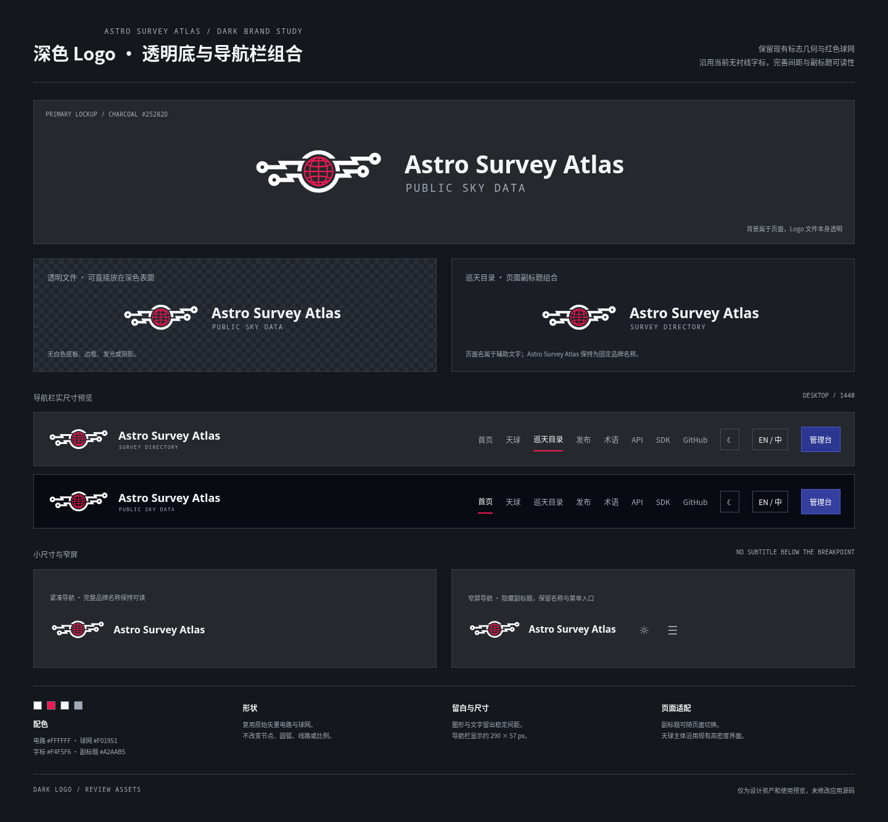

# Astro Survey Atlas · 深色 Logo 与导航组合

本轮先完成深色 Logo。沿用你现有版本的方向：透明背景、白色电路、红色天球和浅色字标。图形直接复用仓库已有深色 SVG，节点、线路、圆弧和球网均未重画。

调整集中在组合和使用：固定图形与文字的间距，明确品牌名与页面副标题的层级，提高副标题的可读性，为完整导航和窄屏准备不同尺寸。**没有白色底板，也没有发光、阴影、滤镜或点阵化的 Logo。**

## 查看设计

- [打开完整预览图](logo-review.png)
- [打开导航栏实尺寸预览](nav-preview.png)
- [单页 PDF](logo-review.pdf)

预览中的炭黑、近黑和棋盘格属于页面背景，不包含在 Logo 文件中。

## 下载透明资产

| 用途 | SVG | PNG |
| --- | --- | --- |
| 通用组合：PUBLIC SKY DATA | [矢量文件](asa-dark-lockup.svg) | [透明 PNG](asa-dark-lockup.png) |
| 巡天目录：SURVEY DIRECTORY | [矢量文件](asa-dark-directory.svg) | [透明 PNG](asa-dark-directory.png) |
| 紧凑组合：只显示品牌名 | [矢量文件](asa-dark-compact.svg) | [透明 PNG](asa-dark-compact.png) |
| 原始图形：电路与天球 | [原始深色标志](asa-dark-mark.svg) | — |

PNG 为 1472 × 288 像素、RGBA 透明文件；SVG 可缩放，组合字标所用字体已内嵌。GitHub 文件页的 Raw / Download 可下载文件。白色网页直接预览时，浅色电路与文字可能不明显，请以深色使用预览为准。

## 使用规范

| 项目 | 规范 |
| --- | --- |
| 电路 | #FFFFFF，与现有深色 SVG 一致 |
| 天球 | #F01951，保留品牌红色 |
| 品牌名称 | Astro Survey Atlas，#F4F5F6，现有 Noto Sans 字体体系 |
| 页面副标题 | 等宽字体，#A2AAB5；与品牌名分层 |
| 桌面导航 | 组合显示约 290 × 57 px，按导航实际宽度调整 |
| 窄屏 | 使用无副标题组合，保留完整名称与菜单入口 |
| 背景 | 文件透明；直接放在深色导航栏上 |

页面副标题可随首页、天球、巡天目录等页面切换，主品牌名称和图形保持一致。浅色主题继续使用原有蓝色电路版本。

## 已调整的整体设计方向

- **天球：** 保留当前版本的信息量、布局和完整操作，不采用 v3 的简化工作页。
- **首页：** 仅沿用你认可的排版、下方示意图和 Tab 方块表达；其余部分重新评估。
- **其余页面：** 巡天目录、发布、术语、API、SDK、项目页及管理台均需补齐设计，当前尚未出页面稿。
- [完整页面范围与必须保留的功能](next-page-scope.md)

## 验证与范围

原始深色图形文件与仓库文件逐字节一致；组合中的电路 path 与球网元素也逐项保持一致。三个 PNG 的透明通道、SVG 内嵌字体、完整导航栏、窄屏组合和单页 PDF 已检查。

本提交只含设计资产、预览与说明，未修改应用源码或启动业务环境。字体许可见 [FONT-LICENSE.txt](FONT-LICENSE.txt)。
