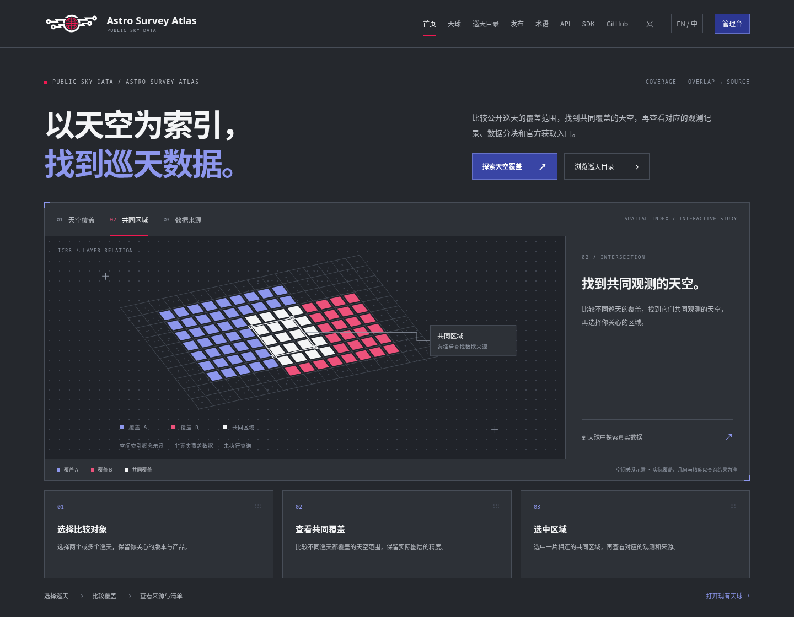
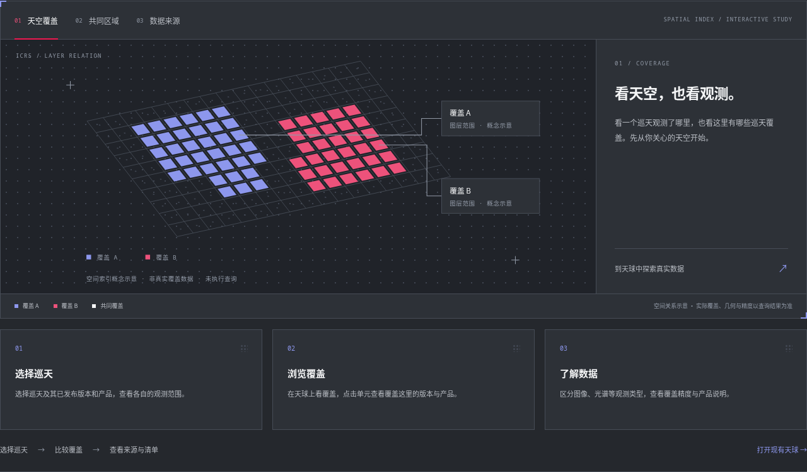
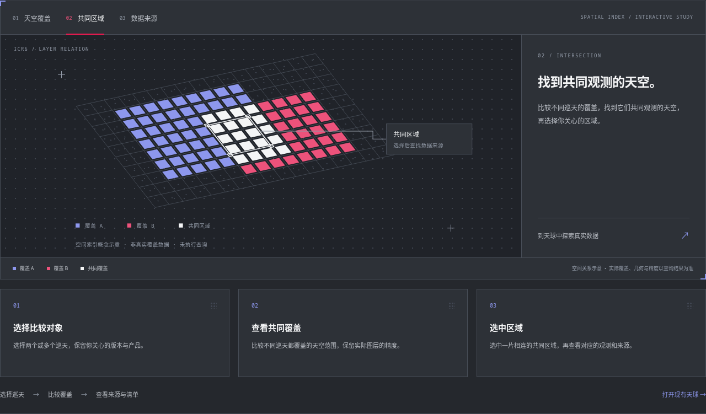
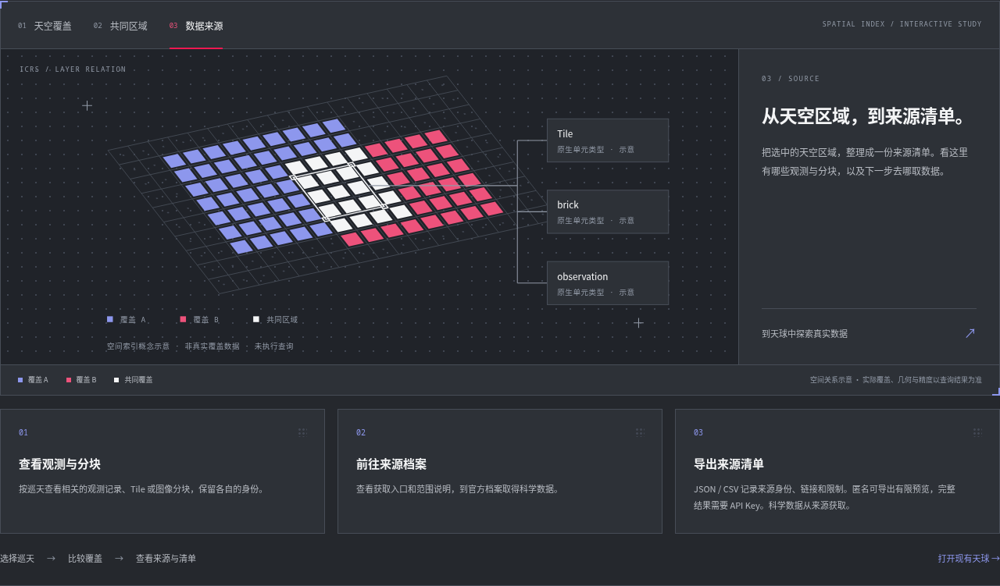
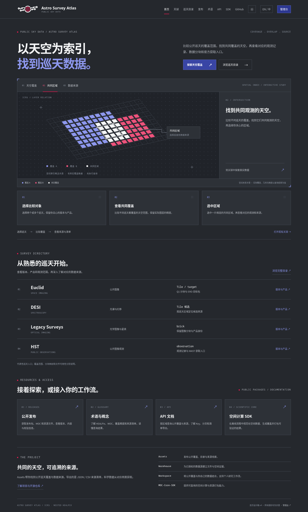
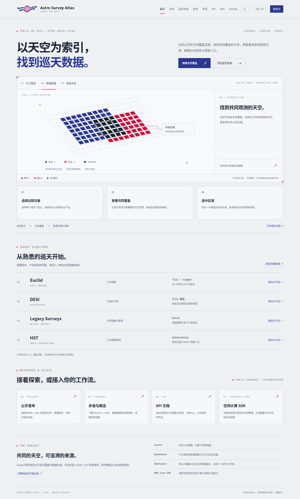
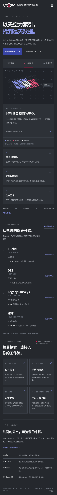
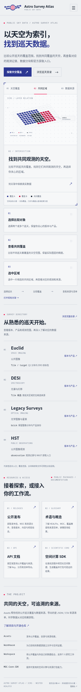

# Astro Survey Atlas · 深色首页设计稿 v4

根据已确定的深色 Logo 和炭黑主题重做首页。透明白色电路、红色天球与浅色字标直接融入导航栏，保留已认可的标题排版、局部网格示意图，以及 Tab 下方方块。

本轮只设计首页。天球入口指向现有页面，未修改天球、其他业务页面或应用源码。

## 先看首页效果

- [深色首页完整图](homepage-dark-v4.png)
- [手机深色首页](homepage-mobile-dark-v4.png)
- [两页 PDF](homepage-v4.pdf)：深色主稿与浅色对应稿。

## 直接体验 Tab 切换

[下载交互预览 ZIP](homepage-preview-v4.zip)。解压后，在浏览器打开 `index.html` 即可；**无需安装组件或启动后端**。

也可下载 [独立 HTML](homepage-preview-v4.html)，保存到本地后直接打开。Logo、字体、样式和脚本均已内嵌。

- 点击 **天空覆盖 / 共同区域 / 数据来源**，图形、右侧说明与下方三个方块会一起切换。
- 可切换黑白主题；手机宽度下可展开完整导航。
- Tab 支持方向键、Home / End；页面链接指向现有网站，点击会离开设计稿。
- 语言按钮保留入口位置；本稿展示中文，点击会显示设计说明。

## 三组 Tab 效果

### 天空覆盖

解释如何选择巡天、浏览观测范围和了解版本、产品与精度。

### 共同区域

突出两个覆盖图层的交集与实线选区，说明如何找到共同观测的天空。

### 数据来源

将选区连接到 Tile、brick、observation 类型，说明获取入口与 JSON / CSV 来源清单。

## 完整首页

下方使用巡天登记行组织 Euclid、DESI、Legacy Surveys 与 HST；发布、术语、API 和 SDK 有独立入口，项目职责集中在页面末尾。

浅色对应稿与手机稿

## 风格与验证

- 主背景采用现有深色体系的炭黑 `#25282D`，配合层次面板、细线与局部规律点阵。
- Logo 使用已确认的透明组合，原图形几何保持一致；导航补齐首页、天球、巡天目录、发布、术语、API、SDK、GitHub、主题、语言与管理台。
- 示意图用于解释流程，不是真实 HEALPix 几何或巡天覆盖；未执行真实查询，未编造结果数量或原生 ID。
- 来源清单与科学数据获取分别说明；匿名可导出有限预览，完整结果需要 API Key。
- 已检查三组 Tab 联动、键盘操作、主题切换、桌面和手机布局、透明 Logo、独立预览资源与 ZIP。PDF 共两页，浏览器错误为零。

字体许可见 [FONT-LICENSE.txt](FONT-LICENSE.txt)。原始深色 Logo 及规范见 [上一轮品牌稿](../dark-logo-v1/README.md)。
