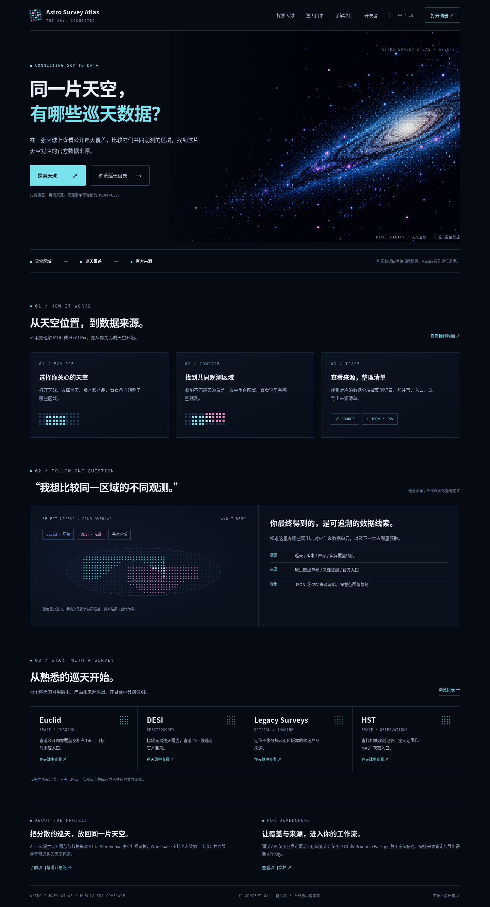
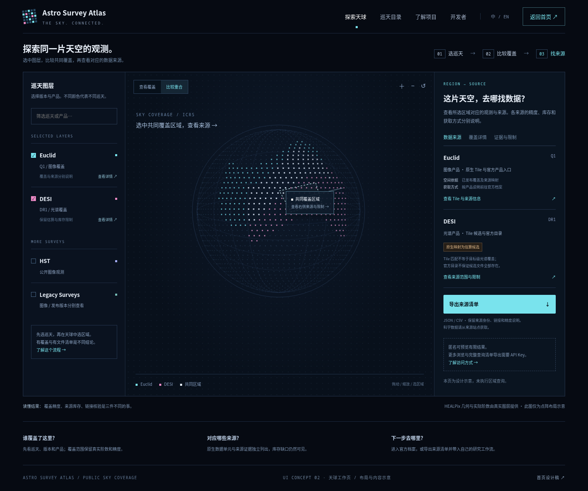
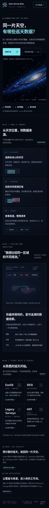

# Astro Survey Atlas · UI 设计稿 v1

**最新稿：[v3 科技感重新设计](../ui-proposal-v3/README.md)**，含黑白首页、天球工作页与手机稿；已移除星云主视觉。

**最新版本：[v2 原始 Logo 与黑白主题设计稿](../ui-proposal-v2/README.md)。** 本页保留第一版记录；Logo 与主题方案以 v2 为准。

本分支用于审阅设计方向：清楚解释项目用途，并将天文点阵语言延续到首页与天球工作页。分支只新增设计图片、PDF 和设计说明，未修改应用源码。

核心路径：**选择天空 → 比较巡天覆盖 → 找到官方数据来源 → 导出来源清单**。

## 查看与下载

- [首页全页设计稿](homepage-v1.png)
- [天球工作页设计稿](atlas-v1.png)
- [移动端首页设计稿](homepage-mobile-v1.png)
- [两页 PDF 设计稿](ui-proposal-v1.pdf)（进入文件页后可点击 Download raw file 下载）
- [完整设计说明与全站建议](ui-design-brief.md)

## 首页

首屏直接回答“同一片天空，有哪些巡天数据？”，随后说明操作流程、结果内容与代表性巡天。系统架构和开发者材料放在较后的位置。

## 天球工作页

左侧选择巡天及产品，中间比较覆盖，右侧查看来源和限制。显式操作入口补充快捷键；导出操作明确称为“来源清单”。

## 移动端首页

## 表达边界

图中的像素银河、点阵天球和来源面板都是设计示意，未执行真实区域查询。实际 HEALPix 界面仍需使用真实球面几何、阶数和精度；来源清单不包含科学数据本身。

设计基于仓库页面与项目文档。提供的示例站点在设计环境中返回 403，未据此判断线上目录、数据数量或服务状态。
