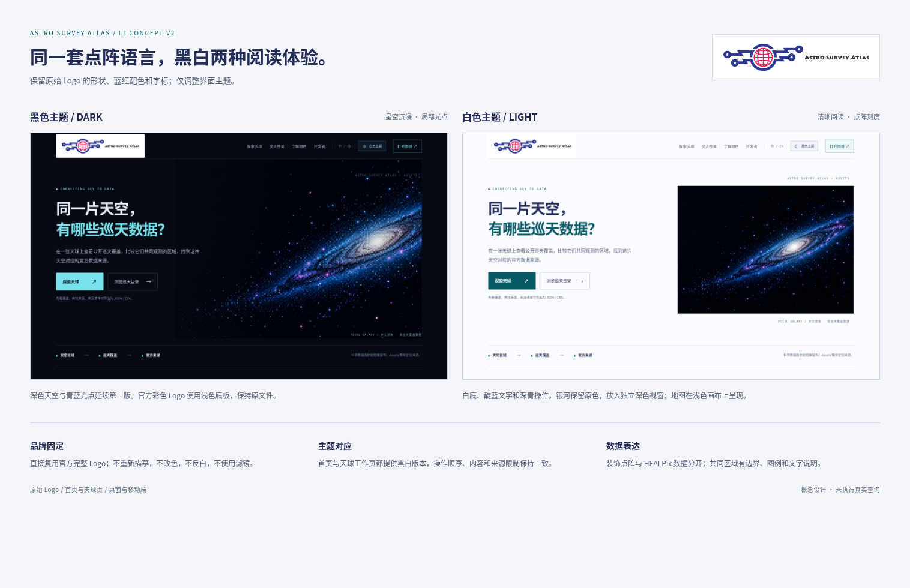
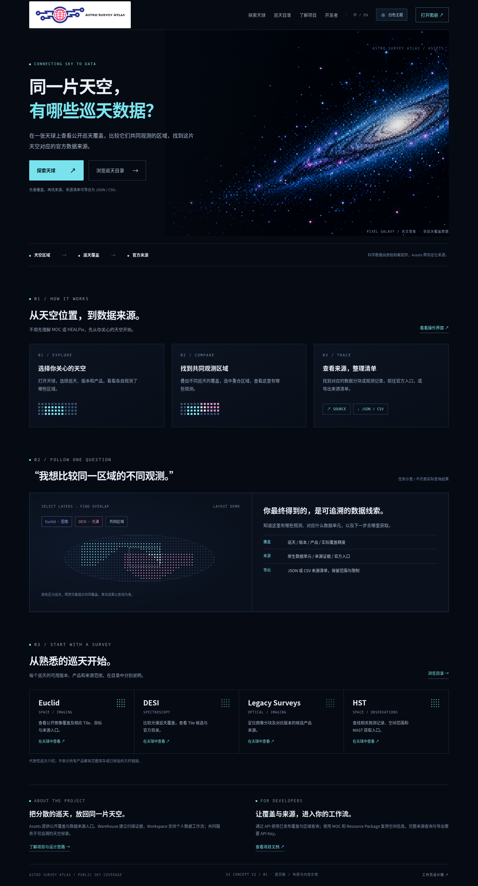
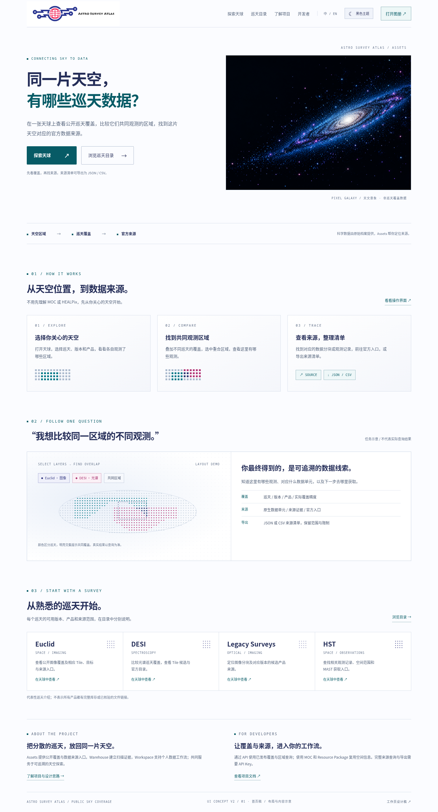
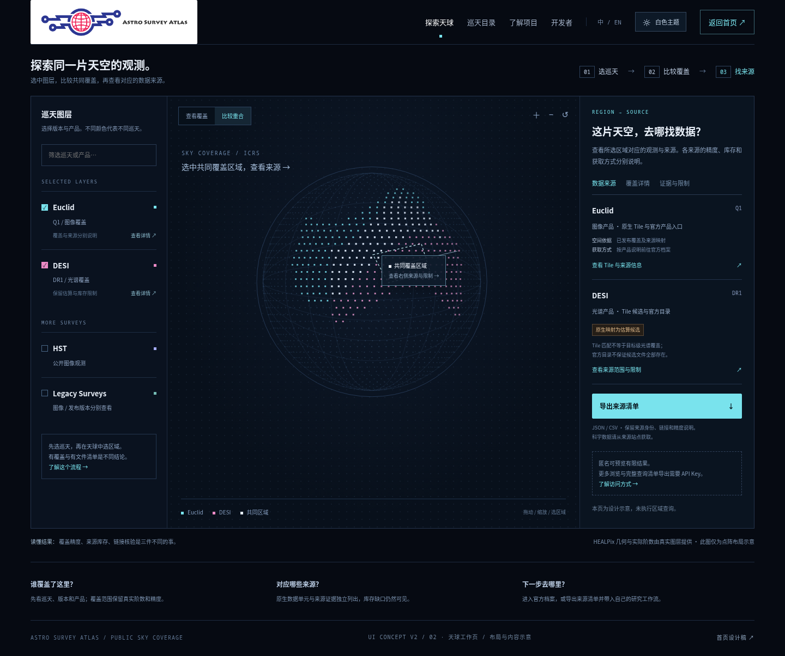
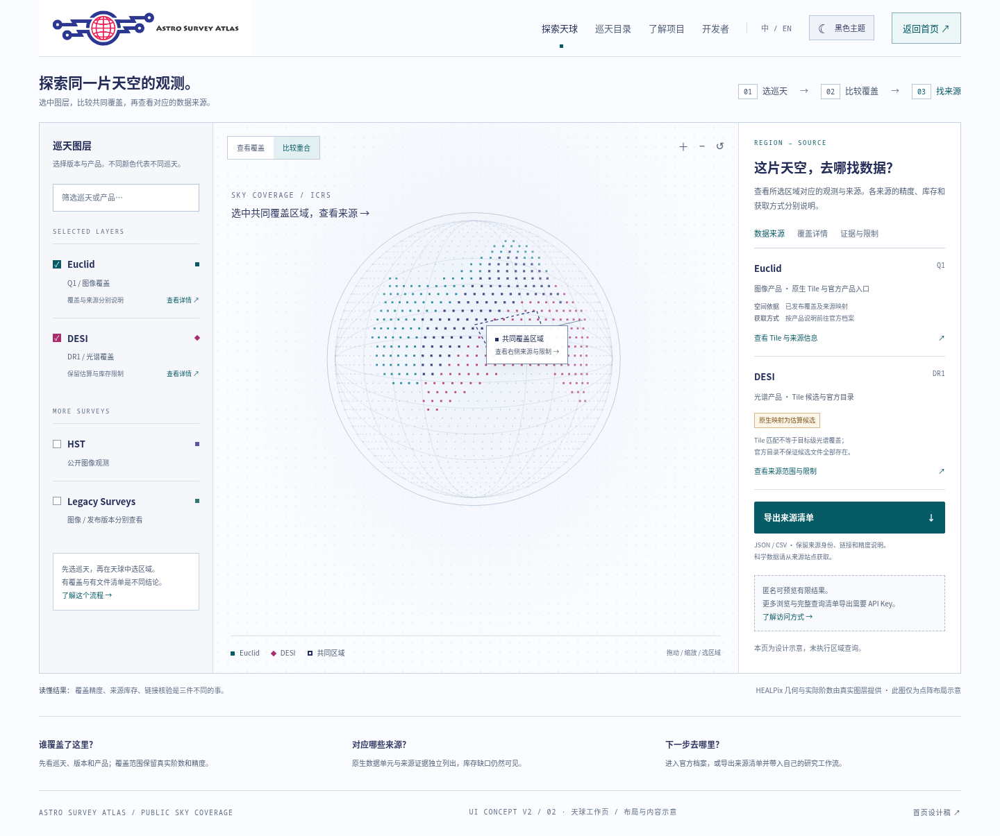
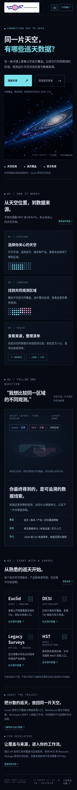
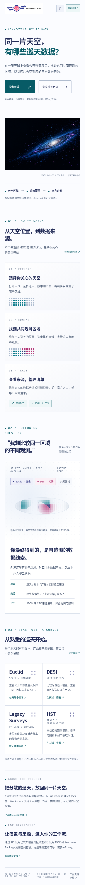

# Astro Survey Atlas · UI 设计稿 v2

这版保留原始 Logo，并为首页、天球工作页补齐黑色与白色主题。点阵天文语言和“选天空 → 比较覆盖 → 找官方来源”这条路径延续第一版。

**品牌保持原样：** 直接使用仓库中的官方完整 Logo，蓝色电路线、红色天球、字标均保留。两主题使用同一个原始图像，没有改色、反白、滤镜或重描。黑色主题用浅色品牌底板提供对比。

本评审分支只新增设计图片、PDF 与说明，未修改应用源码或 main。

## 先看黑白对照

## 查看与下载

| 页面 | 黑色主题 | 白色主题 |
| --- | --- | --- |
| 首页 | [查看黑色首页](homepage-dark-v2.png) | [查看白色首页](homepage-light-v2.png) |
| 天球工作页 | [查看黑色天球页](atlas-dark-v2.png) | [查看白色天球页](atlas-light-v2.png) |
| 移动端首页 | [查看黑色移动稿](homepage-mobile-dark-v2.png) | [查看白色移动稿](homepage-mobile-light-v2.png) |

- [四页 PDF 设计稿](ui-proposal-v2.pdf)：首页黑 / 白、天球黑 / 白。进入文件页后可点击 Download raw file 下载。
- [设计说明与全站建议](ui-design-brief.md)
- [原始官方 Logo 文件](official-logo.png)

## 首页 · 黑色主题

深色天空与青蓝光点延续上一版，首屏直白介绍项目用途。

## 首页 · 白色主题

白底、靛蓝正文与深青操作；银河图保留原色，放在独立深色视窗中。

## 天球工作页 · 黑色主题

## 天球工作页 · 白色主题

浅色画布上使用可辨认的覆盖点、交集边界和文字图例。左侧选巡天，中间比较，右侧找来源。

移动端首页 · 黑白两套

## 表达边界与检查

- 银河、天球点阵及来源面板是设计示意，未执行真实区域查询；实际 HEALPix 仍需保留真实几何、阶数和精度。
- 原始 Logo 文件逐字节一致。桌面与移动端稿已在浏览器中检查；主题切换、导航主题延续及示意图层筛选通过。
- PDF 为四页，每页完整展示一套桌面设计。
