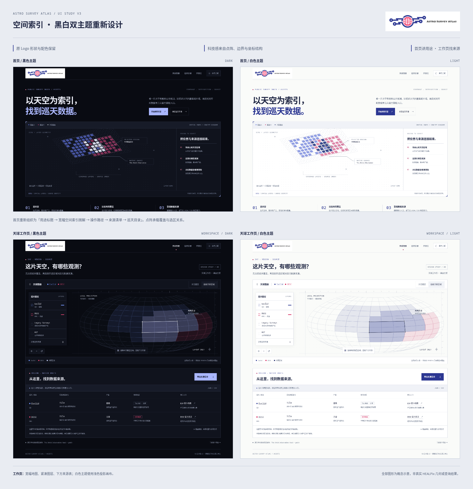
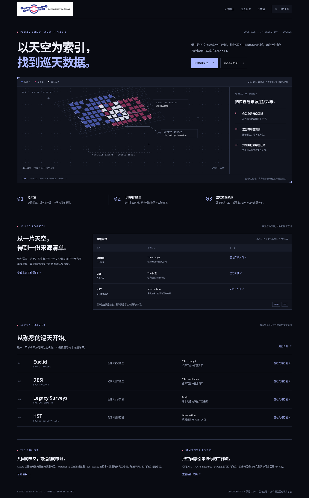
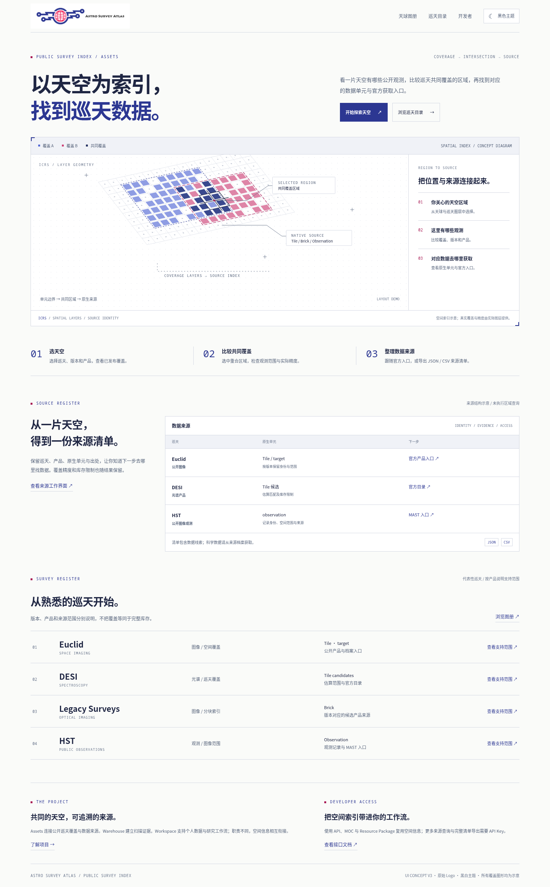
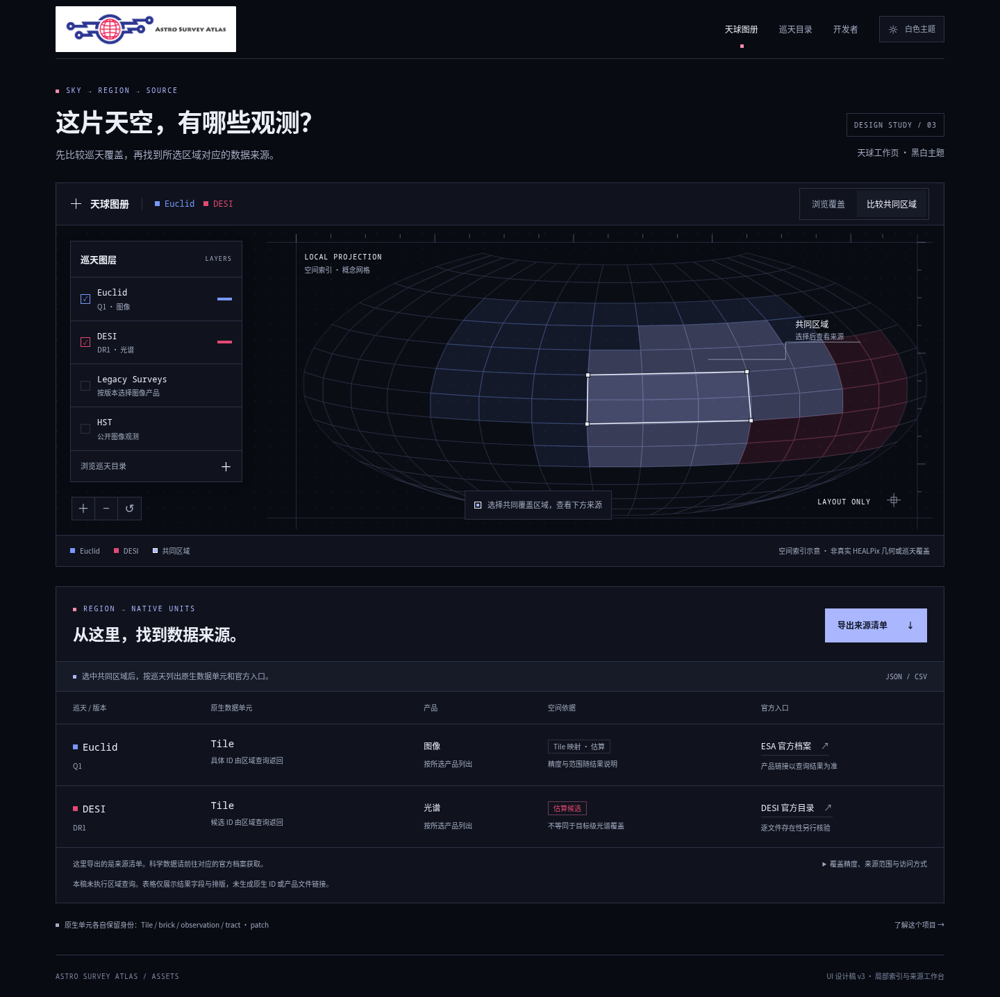
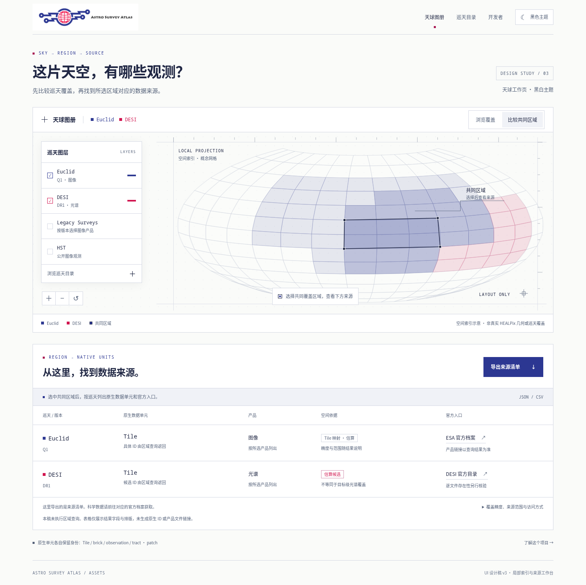
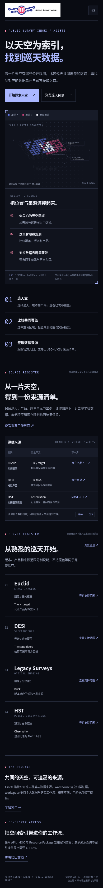
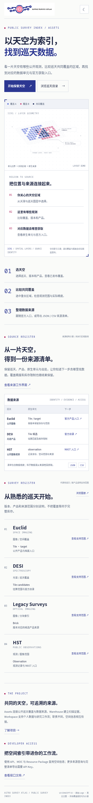
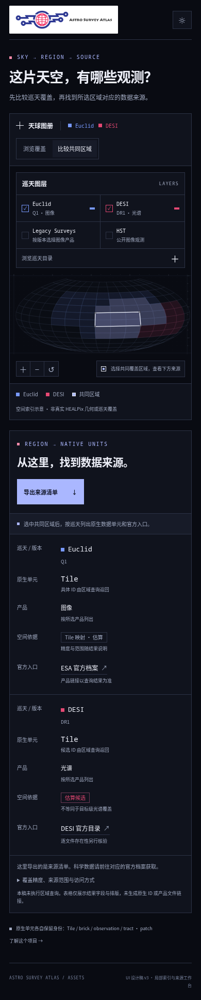
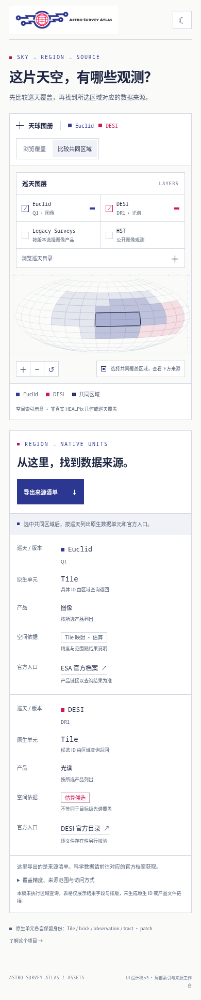

# Astro Survey Atlas · UI 重新设计 v3

这次重新组织首页和天球工作页，移除星云与银河主视觉。科技感来自点阵、空间单元、坐标线、覆盖边界与信息排版。**原 Logo 的形状、蓝红配色和字标保持原样，黑白两套主题均使用同一个官方文件。**

项目用途在首屏直接说明：选择天空区域，比较公开巡天的覆盖，再找到原生数据单元与官方获取入口。导出的是 JSON / CSV 来源清单，科学数据从来源档案获取。

## 先看整体对照

## 查看完整设计

| 页面 | 黑色主题 | 白色主题 |
| --- | --- | --- |
| 首页 | [黑色首页](homepage-dark-v3.png) | [白色首页](homepage-light-v3.png) |
| 天球工作页 | [黑色天球页](atlas-dark-v3.png) | [白色天球页](atlas-light-v3.png) |
| 手机首页 | [黑色手机首页](homepage-mobile-dark-v3.png) | [白色手机首页](homepage-mobile-light-v3.png) |
| 手机天球工作页 | [黑色手机工作页](atlas-mobile-dark-v3.png) | [白色手机工作页](atlas-mobile-light-v3.png) |

- [四页 PDF](ui-proposal-v3.pdf)：完整展示首页黑 / 白、天球工作页黑 / 白。GitHub 文件页可点击 Download raw file 下载。
- [设计说明与全站延伸](ui-design-brief.md)
- [原始官方 Logo](official-logo.png)

## 首页 · 黑色主题

标题与解释并列，下面是一张宽幅空间索引图解，再依次展示操作路径、来源结构和巡天目录。

## 首页 · 白色主题

使用浅色网格画布、靛蓝正文、蓝红覆盖单元；共同覆盖在浅底上用深色强调。

## 天球工作页 · 黑色主题

扩大地图，图层放在紧凑浮层内，来源结果集中在地图下方。浏览覆盖与比较共同区域分成两个明确模式。

## 天球工作页 · 白色主题

地图使用浅色投影画布，保留单元边界和实线选区。来源表直接显示原生单元、空间依据与官方入口。

手机稿：黑白首页与天球工作页

## 设计范围与验证

- 仅更新独立评审分支内的设计图片、PDF 和说明；未修改应用源码或 main，未启动业务服务。
- 所有网格、叠色与选区都是布局示意，未执行区域查询，也不代表真实 HEALPix 几何、阶数或巡天覆盖。
- 没有填入虚构的原生 ID、结果数量或产品文件链接；DESI 的估算候选与真实光谱覆盖分别说明。
- 官方 Logo 与仓库原文件逐字节一致。桌面、手机、主题切换与示意交互已在静态浏览器中检查；PDF 共四页。
