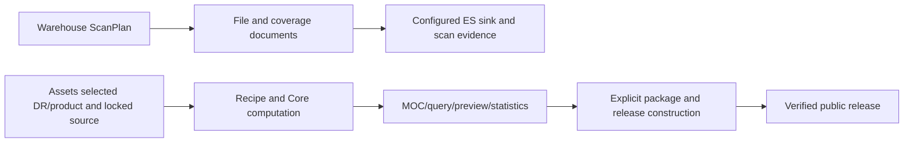
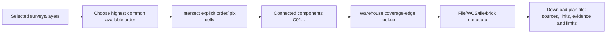

# Coverage workflow and evidence boundary

## Product purpose and download plans

Assets helps users discover where survey data exists, understand the evidence,
and identify its source. Assets never downloads scientific data on users’ behalf.
Users retrieve scientific data themselves from the source under its access policy.

A **download plan** is a downloadable JSON/CSV source manifest: it identifies
the surveys, releases, products and known Tile/block/file units associated with
an overlap region, their matching evidence, source locations and optional links.
It contains metadata and links, not the scientific data itself. A missing link
does not invalidate existing source evidence; show the known source and limits
without fabricating a file or URL. See [the API reference](api-reference.md#csv-and-json-exports)
for the current export format and its known limitations.

Coverage from a collected MOC or footprint and matches from scanned files are
different evidence. An overlap is an intersection at the declared spatial
precision within the indexed scope, not proof of complete data, valid pixels
everywhere or ongoing source availability. Scientific Tile/block identities
come from the source; coverage blocks used to render/query the globe are not
scientific data units.

The `region:query` API Key authorizes full lookup and manifest export, not
access to external data. Serving MOCs, Resource Packages and manifest files,
and reading necessary scan/build inputs, remain separate from downloading
scientific data on users’ behalf.

Every coverage recipe must retain provenance and its coordinate/order contract.
Warehouse scanning and Assets MOC/package construction are separate workflows;
a completed scan does not automatically generate a MOC or Resource Package.
Storage migration follows the [S3 authority implementation plan](s3-authority-implementation-plan.md). Production S3 is the authority for uploaded business data; P0-P6 migration work is complete and pending-upload data remains the explicit exception.

The recipe lock must list each step, implementation reference, source snapshot,
scan run when applicable, available orders, overview order and maximum order.
`order 4` is an NSIDE 16 overview; expanding it to order 8 adds no boundary
information. Order-8 output may come from a native MOC or an explicit geometry
recipe as well as a scan, but must state the actual source precision. Preserve
DR/product/layer membership and partial-coverage limitations; never merge
unrelated DRs or infer full coverage from a partial file set. Catalog RA/Dec
positions describe source distributions, not image footprints without WCS or
other justified field geometry.

Runtime assets are the catalog, layer metadata, overview/query blocks, previews
and published products. Evidence assets are input manifests, normalized scans,
task snapshots, raw MOCs and provenance. Retained evidence is recoverable under
its access policy and is not part of the initial home-page request. Purged
intermediates must not be advertised as byte-for-byte reproducible. In the target
storage model, compute completion and asynchronous upload completion are separate;
pending-upload data is the explicit exception to recovery from S3.

## Public precision gate

Public MOC publication requires a finest actual NUNIQ cell order of at least 4.
The decoded FITS geometry is authoritative: a requested order, FITS header claim,
or an enlarged preview cannot satisfy this gate. Mixed-order MOCs may contain
coarser interior cells alongside cells at order 4 or higher; those remain valid.
Plans report the concrete precision blocker, submissions reject ineligible
products, and the build rechecks both selected and retained frozen geometry.
Withdrawal of an already published low-order product remains allowed.

The globe excludes legacy previews below order 4 before choosing a shared
preview order, so one ineligible cached layer cannot coarsen every other survey.
It does not synthesize finer cells for that layer. Public withdrawal goes through
the normal publication queue and site verification; retained package bytes stay
unchanged.

## Reverse lookup and overlap

The reverse lookup never mixes orders. Each result includes `order`, `nside`,
`precision` (`exact`, `estimated`, `entrypoint-only`, or `truncated`), layer
identity, source file IDs/URIs, WCS RA/DEC summaries and download entrypoints.
If a selected layer only has order 4, the common result is limited to order 4
and explicitly says so.

`coverage_edges.parquet` is the offline reconstruction source. Online lookup
uses Warehouse coverage edges and file records. Ordinary scans use
`ast_file_index_v1`; native batches resolve the fixed scope and committed
partition pointers before joining `ast_file_observation_index_v1`. See
[shared connector batches](scan-batches.md) for the development contract and
completeness limits. The old Assets ES is never a runtime dependency.

## Public workflow explanation and discovery design

The `/releases/` page presents the two current input paths: existing MOC discovery
and bounded Warehouse scans, followed by explicit construction, version review,
incremental publication and website verification. Full release archives remain
export/restore artifacts. See [publication runtime](publication-runtime-split.md).
The [LLM discovery enhancement](moc-discovery-enhancement-design.md) is an optional Assets fallback after a complete zero-result CDS query. It does not
replace scientific validation and human review.
