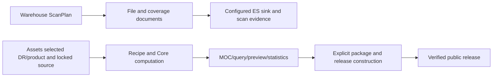

# Coverage workflow and evidence boundary

Every coverage recipe must retain provenance and its coordinate/order contract.
Warehouse scanning and Assets MOC/package construction are separate workflows;
a completed scan does not automatically generate a MOC or Resource Package.
Storage migration follows the [S3 authority implementation plan](s3-authority-implementation-plan.md). Production S3 is the authority for uploaded business data; P2/P3 durability gaps and P5 online cutover remain.

The recipe lock must list each step, implementation reference, source snapshot,
scan run when applicable, available orders, overview order and maximum order.
`order 4` is an NSIDE 16 overview; expanding it to order 8 adds no boundary
information. Order-8 output may come from a native MOC or an explicit geometry
recipe as well as a scan, but must state the actual source precision. Preserve
DR/product/layer membership and partial-coverage limitations; never merge
unrelated DRs or infer full coverage from a partial file set. Catalog RA/Dec
positions describe source distributions, not image footprints without WCS or
other justified field geometry.

Runtime assets are the catalog, layer metadata, overview/query blocks, previews
and published products. Evidence assets are input manifests, normalized scans,
task snapshots, raw MOCs and provenance. Retained evidence is recoverable under
its access policy and is not part of the initial home-page request. Purged
intermediates must not be advertised as byte-for-byte reproducible. In the target
storage model, compute completion and asynchronous upload completion are separate;
pending-upload data is the explicit exception to recovery from S3.

## Reverse lookup and overlap

The reverse lookup never mixes orders. Each result includes `order`, `nside`,
`precision` (`exact`, `estimated`, `entrypoint-only`, or `truncated`), layer
identity, source file IDs/URIs, WCS RA/DEC summaries and download entrypoints.
If a selected layer only has order 4, the common result is limited to order 4
and explicitly says so.

`coverage_edges.parquet` is the offline reconstruction source. Online lookup
uses the warehouse `ast_coverage_index_v1` and `ast_file_index_v1` indices;
the old Assets ES is never a runtime dependency.
