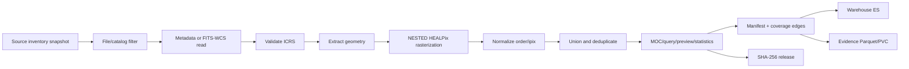

# Coverage workflow and evidence boundary

Astro Survey Atlas Assets has one fixed workflow for every survey and release.
The recipe may choose the input format, but it may not skip provenance or
silently change the coordinate/order contract.

The recipe lock must list each step, implementation reference, source snapshot,
scan run, available orders, overview order and maximum order. `order 4` is an
NSIDE 16 overview; it is not an order 8 measurement. A layer can expose order
8 only when the source scan actually produced order-8 cells.

Runtime assets are the catalog, layer metadata, overview/query blocks, previews
and published products. Evidence assets are input manifests, normalized scans,
task snapshots, raw MOCs and provenance. Evidence remains downloadable and
auditable but is not part of the initial home-page request.

## Reverse lookup and overlap

The reverse lookup never mixes orders. Each result includes `order`, `nside`,
`precision` (`exact`, `estimated`, `entrypoint-only`, or `truncated`), layer
identity, source file IDs/URIs, WCS RA/DEC summaries and download entrypoints.
If a selected layer only has order 4, the common result is limited to order 4
and explicitly says so.

`coverage_edges.parquet` is the offline reconstruction source. Online lookup
uses the warehouse `astro_coverage_index_v1` and `astro_file_index_v1` indices;
the old Assets ES is never a runtime dependency.
