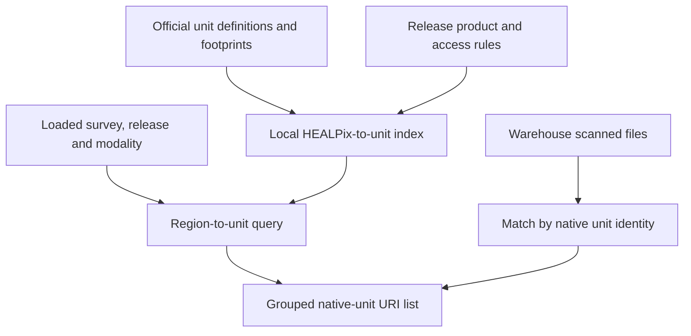
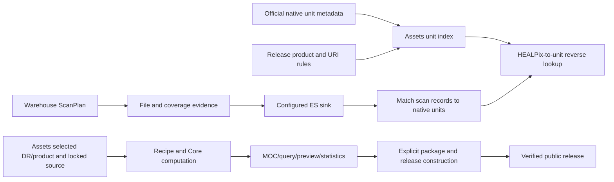
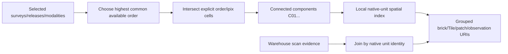

# Coverage workflow and evidence boundary

## Product purpose and download plans

Assets helps users discover where survey data exists, understand the evidence,
and identify its source. Assets never downloads scientific data on users’ behalf.
Users retrieve scientific data themselves from the source under its access policy.

## Core interaction contract

The primary goal is to map a selected sky region to the native spatial units a
user can retrieve, so the user downloads only the relevant parts of a survey.

- In ordinary single-survey mode, clicking a HEALPix cell shows only the
  intersecting data releases and their modalities. It does not start a file
  lookup or a live archive request.
- In overlap mode, the selected region is matched against each loaded survey's
  native spatial units. Return those units, grouped by survey, release and
  selected modality, with source-supported access URIs. Examples include
  brick, Tile, tract/patch, skycell, observation, exposure, block or a native
  HEALPix partition. Keep each survey's actual identity; do not rename all
  units as files or Tiles.
- Clicking a connected component in overlap mode queries its entire region,
  including when a cell selects that component. The reverse-lookup API caps
  one region at 4,096 cells and 100 square degrees. For larger components,
  require a smaller region; the Assets cell inspector may use only the clicked
  cell and must label that scope explicitly. Never silently truncate cells.
- Within a survey, union the selected release/product layers; intersect those
  survey unions at the highest real order supported by every selected product.
  An O4-only product limits the union to O4 even alongside an O8 product; it
  must not disappear from the selected survey. An empty selected survey
  stays in the intersection. No preview is promoted to finer coverage.
- A recipe mode such as `tile-table` describes how an input is read, not the
  native unit type. `sourceUnitKind` declares the identity returned by lookup:
  DESI returns Tiles, while Legacy Surveys returns bricks even if both read a
  table. `sourceUnitIndex.status` is `entrypoint-only` until a usable local
  mapping exists; `estimated` records a working mapping whose geometry or
  association is approximate.
- `sourceUnitIndex` and `warehouseFileIndex` are separate capabilities.
  `sourceUnitIndex` describes survey-native spatial units and their local
  mapping. `warehouseFileIndex` describes scanned files that can be queried by
  Warehouse coverage edges. An exact file scan must not relabel a Tile, brick,
  tract/patch or observation index as a file index, and missing scan edges must
  not erase a source-derived unit mapping.
- Warehouse scan records supplement a matched unit. Attach a “seen in scan”
  state and the scanned file URI only when survey, release, product and native
  unit identity agree. A scan miss or unavailable Warehouse must not remove a
  unit that the official partition definition identifies.
- Keep result browsing aligned with this boundary: the primary spatial-unit
  list and its cursor contain only native unit identities and access URIs.
  Files not attached to a unit, general data/coverage entrypoints and coverage
  evidence belong in separately paged supporting information. A mixed manifest
  omitted count must never be presented as a count of remaining spatial units.
- Make each spatial-unit result scannable in this order: source survey/release/
  product, prominent native unit kind and ID, modality label with the same icon
  mapping used by the survey layer list, matched HEALPix order and cell count
  with a localized precision label, then its source URI as a direct link when
  the URI is browser-safe. Provide an accessible information control explaining
  `exact`, `estimated`, `entrypoint-only` and `truncated`; precision describes
  the result evidence/completeness and must not imply complete survey inventory.
  Keep repeated geometry caveats and access-policy details out of the main text;
  expose meaningful notes and availability status through an accessible
  information control. Do not replace the URI with a copy button. Keep file
  names visible when one unit maps to multiple product URIs.
- Group supporting public source records by survey and expand product/release
  details on demand. This secondary grouping must not take visual priority over
  the matched spatial-unit URI list.
- Unit identity and footprint may come from an official partition table,
  per-unit footprint MOC, WCS, archive region such as `s_region`, or a
  documented deterministic partition rule. Compute candidate units locally
  using a conservative HEALPix spatial index, then intersect their actual
  footprints with the selected region. A regular grid may compute candidates
  directly. Queries must use the full selected HEALPix area, including its
  boundaries, not only its center.
- A survey/release-wide MOC answers where that product claims coverage. It does
  not by itself preserve the identities of the bricks, observations or files
  that make up the coverage. When the official unit grid or rule is available,
  the unit IDs can still be computed from the selected coordinates and joined
  to the release's product/URI rules. Never infer arbitrary observation IDs,
  visits, dates or file existence from a merged coverage MOC.
- A generated URI must be derivable from documented source rules. Distinguish
  a rule-derived access location from a scanned, verified file URI. A catalog
  of point positions is not an image footprint unless the source defines a
  valid mapping from those positions to spatial units.
- An intersecting public MOC may have no match in a frozen native inventory.
  Retain its source identity, coverage evidence and official entrypoint with an
  explicit empty-result note and inventory scope. Source-query failures remain
  incomplete after paging/export; never describe every incomplete result as a
  page limit or manufacture units to fill a missing survey.

The common data flow is:

```mermaid
flowchart TD
  A[Official unit definitions and footprints] --> B[Local HEALPix-to-unit index]
  C[Release product and access rules] --> B
  D[Loaded survey, release and modality] --> E[Region-to-unit query]
  B --> E
  E --> F[Grouped native-unit URI list]
  G[Warehouse scanned files] --> H[Match by native unit identity]
  H --> F
```

The public survey/product selector and the coverage catalog must describe the
same runtime layer set. Source-unit layers can be derived from locked upstream
geometry without a published MOC, but the matching product identity must be
declared in the public survey catalog. They are loaded only when an approved
public release has products; an empty approved release stays empty and the
working survey catalog is not a publication fallback. The site therefore reads `/api/v1/surveys`,
`/api/v1/coverage`, and `/api/v1/coverage/catalog` from the backend runtime
state. A site-only static survey index can otherwise omit tract/patch or other
source-derived products that are present in the coverage catalog. The site
reads survey summaries, coverage summaries and blocks, overlap, overlap details
and reverse lookup from the backend runtime state. The backend waits for its
in-flight source-unit load before serving these endpoints; if an optional
source index fails to load, the public MOC-backed products still remain
available.

Product-layer states such as `awaiting_geometry` or `awaiting_snapshot` describe
the corresponding published coverage/MOC record. They must not be presented as
proof that native-unit reverse lookup is unavailable when a separate locked
source-unit binding can already return the survey's brick, Tile, patch or other
native unit. Describe the two capabilities independently, including whether the
native geometry is estimated and whether each generated access URI has been
verified.

The first MVP covers Euclid, DESI, Legacy Surveys and HST. All eleven
combinations of two or more surveys use the same overlap contract. HSC retains
its existing adapter but is outside this acceptance scope. The adapters share
the query and response model while retaining
survey-specific unit identities and access rules. Adapter readiness is based on
an executable local unit lookup, not a `sourceUnitIndex` label or the presence
of a survey-wide MOC alone. Source-unit input snapshots are locked by path,
source URL, byte size and SHA-256 in
[`source-unit-indexes.lock.json`](../src/layers/recipes/source-unit-indexes.lock.json).
The lock contains references only; snapshot bytes stay in the evidence store
(`ASSETS_SOURCE_UNIT_EVIDENCE_ROOT`, defaulting to `ASSETS_EVIDENCE_ROOT` in
deployment) and are never placed in the browser's initial request.
Current evidence limits are:

- DESI DR1/EDR tile lookup uses the locked `TILE_COMPLETENESS` tables. Its
  circular focal-plane approximation is `estimated`; it identifies candidate
  Tile directories and does not assert target-level spectral coverage.
- Euclid's native unit here is the **Tile**; ESA TAP `q1.mosaic_product`
  `tile_index` is the Tile identity. `stc_s` gives the associated product
  footprint, not the unit identity. Euclid lookup returns Tile IDs and must not
  be described as an `s_region`-identified unit mapping. `file_path` and
  `datalabs_path` are ESA source paths. The locked
  Q1_R1 snapshot contains 2,908 BGSUB mosaic metadata rows, 13 filename product
  groups and 352 Tile IDs. All rows report `published=0`, but anonymous
  filename-based SAS-DD `HEAD` requests for VIS, DES-G, WISHES-Z, PANSTARRS-I
  and CFIS-U returned the matching file response. The local adapter maps these
  BGSUB products to Tiles and provides one ESA SAS-DD URI per filename. This is
  the declared BGSUB inventory scope, not the complete Euclid Q1 inventory or
  complete survey coverage. The output identity remains Tile; Warehouse WCS
  edges and merged Q1/ERO MOCs are not substitutes for the Tile inventory.
  The aggregate Q1 deep-fields layer uses the same locked BGSUB snapshot and
  groups matching product URIs by the native `tile_index` for the clicked
  HEALPix. Those results remain estimated and limited to this inventory scope.
- Euclid ERO has no verified Tile inventory. Lookup returns named `target`
  packages only when official ERO XML and ESA Sky outreach `stc_s` agree on
  target identity. The outreach footprint is an estimated target extent,
  not a verified instrument/filter footprint. Preserve every official matching
  Stack/Catalog package URI and the source snapshot hash; do not inspect the
  package's scientific contents or infer an ERO Tile ID.
- HST overlap reverse lookup uses the SHA-locked public MAST CAOM metadata
  snapshot and its local SQLite footprint index. The index stores order-4
  candidate buckets, then intersects saved `s_region` values against the
  selected cells; it returns observation IDs and MAST links without making a
  request-time MAST query or expanding science products. To keep complex CAOM
  footprints buildable, regions with more than 4 total polygon vertices use
  a spherical cap enclosing each polygon for candidate and query-cell
  matching. The saved original `s_region` remains attached, but this estimated
  cap match can include nearby false-positive candidates. Snapshot pages and
  the derived index are evidence on the Assets evidence PVC. Unsupported
  spatial rows keep results marked incomplete. Both ordinary HST cell lookup
  and overlap reverse lookup use this snapshot. The HST image-lookup API returns
  observation identities and MAST entry links; it does not make a request-time
  query for file-level products. Users follow the MAST link for the current
  product list and access policy.
- HSC-SSP PDR2's official Available Data page publishes 11 machine-readable
  tract/patch geometry lists for its DUD and Wide fields. They are captured
  and SHA-256 locked separately from the PDR3 lists. Six PDR2 product
  identities are bound to the PDR2 geometry. At runtime, these patch polygons
  provide ICRS/NESTED O4 and O8 coverage and candidate `tract/patch` matches;
  the runtime coverage is estimated and does not generate or publish a MOC.
  Results link to PDR2 DAS Search, where band-specific file availability and
  account access must be confirmed.
- HSC-SSP PDR3 Wide/Deep/UltraDeep lists are also captured and SHA-256 locked.
  The PDR3 product binding uses only those PDR3 lists and exposes its own
  estimated runtime O4/O8 coverage and candidate `tract/patch` matches. Never
  reuse PDR3 geometry as PDR2 product inventory. HSC search requires a
  registered account, and patch matches do not prove a filter-specific file
  exists. HSC's official PDR3 `downloadCutout.py` also documents authenticated
  coordinate cutouts with selectable size, filter and image layers, plus an
  optional tract. It accepts no patch ID and returns cutout FITS files rather
  than an original patch URI. Treat it only as a smaller-download cutout
  option, not as the access URI for the matched `tract/patch`; see the
  [HSC access research note](research/hsc-tract-patch-access.md).
- Legacy Surveys DR1's official `decals-bricks.fits` snapshot supplies brick
  boundaries plus `has_image_g/r/z` and `has_catalog` membership flags. The
  local source-unit matcher returns separate Coadded imaging and Tractor
  catalog brick lists; Coadd URIs follow the DR1 per-band path rule, and
  Tractor URIs follow `tractor/<AAA>/tractor-<brick>.fits`. The O4 overview
  marks brick-center cells; lookup intersects the full selected HEALPix cell
  with each brick polygon. Both mappings are estimated and their generated
  file URIs remain unverified until checked at the source. The snapshot is an
  evidence input, not a published MOC or a Warehouse scan.
- Legacy Surveys DR2's official `decals-bricks-dr2.fits` release roster
  supplies 318,032 brick rows with their own identity, boundaries and per-band
  `nobs_med`/`nobs_max` columns. The runtime native-unit index currently covers
  separate Tractor catalog and Coadded imaging brick lists. Tractor URIs follow
  the documented `tractor/<AAA>/tractor-<brick>.fits` rule; one sample file
  returned HTTP 200, while each candidate remains unverified. Coadd candidates
  include bands with positive `nobs_max_*` and follow the official NOAO FTP
  path linked by the Legacy DR2 files page. The NERSC Coadd directory says its
  files were removed, and the FTP host did not resolve in the verification
  environment; those URIs remain unverified candidates, not confirmed file
  inventory. `nobs_max_*` is exposure evidence, not proof that an individual
  image file exists. This roster is evidence input, not a MOC or a scan.
- Legacy Surveys DR3-DR7 use the official release-specific
  `survey-bricks-drN.fits.gz` roster; DR8 and DR9 use separate official North
  and South rosters. The release rosters provide native brick IDs, centers and
  `NEXP_g/r/z` summaries. DR9 South also carries brick bounds. Their brick
  identities and centers have been joined to the locked all-sky brick grid;
  every checked center matches, and the available DR9 South bounds match the
  grid. The common grid supplies the per-brick polygons, while each release's
  roster supplies its membership scope.
  Runtime lookup uses `NEXP_band > 0` only to select candidate coadd bands; it
  is not proof that an individual image file exists. Tractor candidates use
  the release roster's listed bricks. The URI rules follow the corresponding
  first-party release pages and sampled release directories: DR3-DR4 coadds use
  `coadd/<AAA>/<brick>/legacysurvey-<brick>-image-<band>.fits`; DR5-DR7 use
  the same path with `.fits.fz`. Tractor uses
  `tractor/<AAA>/tractor-<brick>.fits`; DR8/DR9 add their `north/` or
  `south/` prefix and coadd images also use `.fits.fz`. These are rule-derived,
  unverified candidate URIs. DR8/DR9 North and South results retain both
  region-specific paths under the native brick identity. All returned matches
  remain `estimated`; the compressed FITS rosters are evidence metadata, not
  object catalogs, science products, MOCs or Warehouse scans.
- DESI Legacy DR10 uses the locked all-sky brick grid and the official South
  release summary, which has 366,912 rows and `NEXP_g/r/i/z` columns. Every
  South roster member is checked against its all-sky center and bounds; no
  North roster or North product tree is published on the official DR10 files
  page; the checked North roster and Coadd paths return 404. A missing DR10
  brick outside the South roster is therefore an unsupported release region,
  not evidence that the all-sky grid lookup failed. Northern Legacy coverage
  must retain its actual release identity, such as DR9 North. Coadd reverse lookup returns only the
  band-specific files whose corresponding `NEXP` value is positive, under
  `south/coadd/<AAA>/<brick>/legacysurvey-<brick>-image-<band>.fits.fz`.
  Tractor candidates use the documented flat
  `south/tractor/<AAA>/tractor-<brick>.fits` layout. Positive exposure
  summaries are membership evidence, not per-file existence proof; returned
  candidates remain estimated. The O4 overview marks cells containing brick
  centers and is indicative rather than boundary-complete. Full-cell reverse
  lookup intersects each native brick polygon. The existing color-imaging MOC
  remains independent. In the Abell 2390 O8 sample `[202250,202272]`, local
  lookup returned 11 South bricks for both Coadded imaging and Tractor; brick
  `3281p177` has candidate coadd links for g/r/i/z. See the [source access research
  note](research/native-block-access-uris.md). The live acquired DR10
  color-imaging ProductStore record still declares `modality: catalog` even
  though its MOC provenance identifies image coverage; that public metadata
  mismatch remains separate from the new Coadded imaging layer.
- HSC PDR2 geometry uses its own 11 locked PDR2 lists. The six identity
  bindings create runtime coverage layers from official tract/patch polygons;
  matching returns candidate tract/patch identities and a PDR2 DAS Search
  entrypoint, not a filter-specific file URI. PDR3 has a separate product
  binding and uses only its own locked PDR3 lists. Runtime HSC O4/O8 cells are
  estimated query geometry, not a generated or published MOC, and do not prove
  that any band-specific file exists. The official public documentation does
  not specify a tract/patch-prefilled DAS URL contract, so the link is a
  release-scoped search entrypoint; users select the returned tract/patch and
  product after signing in. See the [source access research note](research/native-block-access-uris.md).

The shared matcher buckets each unit center in an order-4 NESTED index. For a
query, it expands each selected order-4 parent cell by the layer's largest
unit-footprint radius plus the HEALPix order-4 maximum pixel radius, then uses
those cells to find candidate unit centers. This cap-based broad phase is
conservative: any unit intersecting the selected parent cell must have its
center within that expanded radius. The matcher then intersects each candidate
unit's polygon or documented circular approximation with the complete
requested HEALPix cells. This avoids rasterizing every unit during startup;
candidate matches still use the declared source geometry and remain
`estimated` when that geometry or inclusive rasterization does not establish
file existence.
One native unit can carry multiple source URIs (for example, multiple ESA
products for one Euclid Tile); JSON and CSV preserve every listed URI and its
filename. `accessAvailability` and notes distinguish public access, source
account policy and unverified rule-derived locations.

### Index direction and storage

The runtime does not store a URI list for every high-order HEALPix pixel. It
joins three pieces of metadata when a region is queried:

1. A release inventory maps `(survey, release, product)` to native unit IDs and
   membership details, such as Legacy brick bands or North/South membership.
2. A source geometry roster maps each native unit ID to its ICRS center and
   footprint. For Legacy DR3-DR9, release rosters join to the shared all-sky
   brick geometry by `BRICKNAME`.
3. A coarse order-4 NESTED lookup maps each center's HEALPix cell to candidate
   unit row indices. The query expands candidate cells conservatively, checks
   each candidate against the complete selected HEALPix footprint, then
   generates its source-documented URI from the matched native unit ID.

The compressed, hash-locked source rosters live on the evidence PVC and are
archived with managed index versions. The installed baseline generic SQLite is
`derived/source-unit-indexes/native-units.sqlite` beneath the configured source
unit evidence root. The management workflow acquires or imports official
metadata, builds an isolated candidate, verifies product bindings and real
lookups, reviews explicit gaps, archives every input/index and activates a
separate native-index authority pointer. Changed releases use incremental
SQLite construction; query requests open existing approved databases read-only
and never cold-build a missing or incompatible index. Build identity records
the source lock, layer registry, DESI recipes, implementation and schema.
Shared unit geometry is stored once, while release/product membership is stored
separately. Legacy DR3-DR9 membership stores region and band masks and recreates
the documented URI from the native brick ID at query time, rather than
duplicating full URI strings for every release row. The short-lived builder
worker exits before the read-only query worker starts. The query loads only
coarse-cell candidates and then intersects the full requested HEALPix footprint
with their native geometry.

See [native unit management](native-unit-management.md) for source revisions,
frozen snapshots, independent review, archive keys, CAS activation and recovery.
HST observation and ERO target metadata are also acquired and locked through
this workflow; ordinary lookups do not fetch MAST or ERO metadata. A known HST
product whose observation is absent from the selected snapshot retains its
published coverage and official source identity, with an explicit accepted gap
and entrypoint-only native lookup. A coarse candidate bucket cannot substitute
for an intersection with the original footprint in verification samples.

The Legacy DR3-DR9 inputs total about 218 MiB compressed across about 1.35
million release/region rows; they contain IDs, membership flags, centers and
boundaries, not source catalogs, spectra or images. On the local locked
snapshots, the first normalized SQLite build produced a 1,660,219,392-byte
index, reached 2,018 MiB peak process RSS during the temporary build, and
returned to 301 MiB process RSS after the query worker opened the cache.

Dev revision 287 logged the completed 1,660,219,392-byte index about 6m37s
after the backend began listening. Since the builder start time was not logged,
this is an observed end-to-end interval, not an exact build duration. The
builder log recorded 3,537 MiB peak process RSS, 937 MiB after the builder
exited, and 950 MiB after the query worker opened the cache. `kubectl top`
sampled up to 3,393 MiB during the build and 1,691-1,797 MiB after readiness
and four live survey queries. A cgroup sample reached 3,934,007,296 bytes of
the 4 GiB limit; `oom`, `oom_kill` and restart counts stayed at zero. The
steady-state measurements do not justify increasing the limit for the current
index. The cold-build peak and six-minute build duration remain optimization
targets; prefer reducing or streaming build-time allocations before adding
more source rosters. Warehouse Elasticsearch remains the index for scanned-file
evidence; it is not the authoritative store for official native unit
inventories.

Do not report these adapters as complete until a query over the full selected
HEALPix area can return source-supported unit identities and access locations
without relying on Warehouse file hits, and the adapter is connected to a
selectable product layer. When a source catalog, native partition rule or
per-unit footprint is missing, report that index gap and retain the separate
coverage evidence.

A **download plan** is a downloadable JSON/CSV source manifest: it identifies
the surveys, releases, modalities and native spatial units associated with an
overlap region, their source-supported access locations and any matched scan
evidence. It contains metadata and links, not the scientific data itself. A
missing access link does not invalidate an existing unit identity; show the
known unit and limits without fabricating a file or URL. See [the API
reference](api-reference.md#csv-and-json-exports) for the current export format
and its known limitations.

Coverage from a collected MOC or footprint and matches from scanned files are
different evidence. An overlap is an intersection at the declared spatial
precision within the indexed scope, not proof of complete data, valid pixels
everywhere or ongoing source availability. Scientific Tile/block identities
come from the source; coverage blocks used to render/query the globe are not
scientific data units.

The `region:query` API Key authorizes full lookup and manifest export, not
access to external data. Serving MOCs, Resource Packages and manifest files,
and reading necessary scan/build inputs, remain separate from downloading
scientific data on users’ behalf.

Every coverage recipe must retain provenance and its coordinate/order contract.
Warehouse scanning and Assets MOC/package construction are separate workflows;
a completed scan does not automatically generate a MOC or Resource Package.
Storage migration follows the [S3 authority implementation plan](s3-authority-implementation-plan.md). Production S3 is the authority for uploaded business data; P0-P6 migration work is complete and pending-upload data remains the explicit exception.

```mermaid
flowchart LR
  A[Official native unit metadata] --> B[Assets unit index]
  C[Release product and URI rules] --> B
  D[Warehouse ScanPlan] --> E[File and coverage evidence]
  E --> F[Configured ES sink]
  F --> G[Match scan records to native units]
  B --> H[HEALPix-to-unit reverse lookup]
  G --> H
  I[Assets selected DR/product and locked source] --> J[Recipe and Core computation]
  J --> K[MOC/query/preview/statistics]
  K --> L[Explicit package and release construction]
  L --> M[Verified public release]
```

The recipe lock must list each step, implementation reference, source snapshot,
scan run when applicable, available orders, overview order and maximum order.
`order 4` is an NSIDE 16 overview; expanding it to order 8 adds no boundary
information. Order-8 output may come from a native MOC or an explicit geometry
recipe as well as a scan, but must state the actual source precision. Preserve
DR/product/layer membership and partial-coverage limitations; never merge
unrelated DRs or infer full coverage from a partial file set. Catalog RA/Dec
positions describe source distributions, not image footprints without WCS or
other justified field geometry.

Product modality and spatial extraction are separate contracts. Redshift
classifies a product; it does not imply that every source in a position catalog
has a redshift. The catalog-radec mode remains for deriving source occupancy
from table coordinates. The path-healpix mode is for inventories whose
directory structure assigns each real file URI to an explicit NESTED pixel and
group. For DESI DR1 bright-program redrock files, RA/Dec first maps to the native
order-6 cell, then reverse lookup returns only indexed redrock file URIs for
that cell. The bright-program rule matches `redrock-main-bright-*.fits*` because
the same pixel directory also contains coadd, emission-line and QSO products.
It does not return the aggregate zall-pix-iron.fits in place of the partition
files, and it does not claim BGS-only row selection.

Survey-specific spatial units stay distinct but use the common lookup flow.
Euclid Q1 MER products map by official `tile_index`; the returned unit is the
Euclid Tile. The TAP row's `stc_s` supplies its product footprint, while its
filename and ESA repository or Data Labs paths supply product access metadata.
Those paths are not assumed to be anonymous direct-download URLs. DESI tile
products use the source Tile identity and footprint; redrock products use their
native order-6 HEALPix partition, which is not a Tile. HST uses a MAST
observation ID as its unit identity, looks up the saved observation `s_region`
in the local snapshot index, and links to the MAST observation page. A Tile ID, product footprint, HEALPix
file partition and observation region are not interchangeable identities. A
survey-wide MOC can filter candidate space, but it cannot replace the
native-unit identity and footprint source.

Runtime assets are the catalog, layer metadata, overview/query blocks, previews
and published products. Evidence assets are input manifests, normalized scans,
task snapshots, raw MOCs and provenance. Retained evidence is recoverable under
its access policy and is not part of the initial home-page request. Purged
intermediates must not be advertised as byte-for-byte reproducible. In the target
storage model, compute completion and asynchronous upload completion are separate;
pending-upload data is the explicit exception to recovery from S3.

## Public precision gate

Public MOC publication requires a finest actual NUNIQ cell order of at least 4.
The decoded FITS geometry is authoritative: a requested order, FITS header claim,
or an enlarged preview cannot satisfy this gate. Mixed-order MOCs may contain
coarser interior cells alongside cells at order 4 or higher; those remain valid.
Plans report the concrete precision blocker, submissions reject ineligible
products, and the build rechecks both selected and retained frozen geometry.
Withdrawal of an already published low-order product remains allowed.

The globe excludes legacy previews below order 4 before choosing a shared
preview order, so one ineligible cached layer cannot coarsen every other survey.
It does not synthesize finer cells for that layer. Public withdrawal goes through
the normal publication queue and site verification; retained package bytes stay
unchanged.

## Reverse lookup and overlap

### Public/private ownership and manifest snapshots

Assets owns public native-unit indexes, region mappings, caches and immutable
reverse-lookup snapshots. An authenticated lookup freezes one bounded query in
the Assets evidence store for one hour. Continuation uses that same snapshot,
region, layer revisions, page kind and API-Key identity; it never reruns an
archive or Warehouse query. Query exhaustion is not survey inventory completeness.

Without a Key, Assets exports its current six-item anonymous preview and
preserves omitted/truncated status. With a valid `region:query` Key, export
drains the same snapshot and updates the displayed result to the exported list.
JSON and CSV preserve native identities, all URIs, modalities, footprints,
actual orders, precision, source evidence and availability.

Workspace installs only public layer metadata and MOC/preview geometry. It
intersects those layers with the user's CSST coverage locally, then calls
Assets server-side with an API Key and only public layer IDs, order/cells and
cursor/snapshot selectors. Public native indexes and responses must never be
persisted as Workspace files, caches, artifacts, production recipes or log
bodies. Responses may exist in request/browser memory and transient browser
manifest exports only. No Key or an invalid Key leaves public native lookup
unavailable; geometry and private results remain available, with no anonymous
or crawler fallback.

CSST files, scans, MOCs, cell mappings and directory indexes stay in Workspace.
They never enter an Assets request, evidence object, package or release. Private
reverse lookup returns deduplicated immediate parent directories of matched
indexed files, preserving their actual order and precision. A scan root is not
a substitute for a missing file mapping. Workspace may aggregate matching file
identities in its private index before resolving parents; any representative
native cells must be marked `matchingCellsTruncated`, independently from omitted
parents (`directoriesTruncated`), and retained in JSON/CSV exports. See the
[four-survey MVP scenario](four-survey-mvp.md).

```mermaid
flowchart LR
  A[Selected surveys/releases/modalities] --> B[Choose highest common available order]
  B --> C[Intersect explicit order/ipix cells]
  C --> D[Connected components C01...]
  D --> E[Local native-unit spatial index]
  E --> F[Grouped brick/Tile/patch/observation URIs]
  G[Warehouse scan evidence] --> H[Join by native unit identity]
  H --> F
```

The reverse lookup never mixes orders. Each unit result includes survey,
release, product/modality, unit kind and native ID, selected `order`/`nside`,
matching cells, geometry precision, source snapshot and source-supported access
location. Warehouse files are nested scan evidence on the matched unit; they
do not define the unit result. Paginate by native units. If a selected layer
only has order 4, the common result is limited to order 4 and explicitly says
so. Distinguish an unavailable unit index from an empty spatial match.

`coverage_edges.parquet` is the offline reconstruction source. Online lookup
uses Warehouse coverage edges and file records. Ordinary scans use
`ast_file_index_v1`; native batches resolve the fixed scope and committed
partition pointers before joining `ast_file_observation_index_v1`. See
[shared connector batches](scan-batches.md) for the development contract and
completeness limits. The old Assets ES is never a runtime dependency.

## Public workflow explanation and discovery design

The `/releases/` page presents the two current input paths: existing MOC discovery
and bounded Warehouse scans, followed by explicit construction, version review,
incremental publication and website verification. Full release archives remain
export/restore artifacts. See [publication runtime](publication-runtime-split.md).
The [LLM discovery enhancement](moc-discovery-enhancement-design.md) is an optional Assets fallback after a complete zero-result CDS query. It does not
replace scientific validation and human review.
