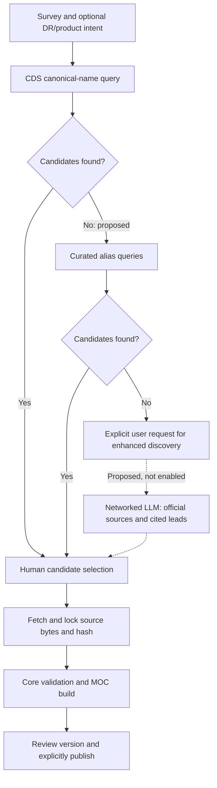

# MOC discovery enhancement design

Status: proposed, not enabled. No LLM/search provider, credential, new API or
execution policy is installed by this documentation/UI change.

## Current behavior and proposed discovery

The current Warehouse `cds-public-moc-v2` worker performs a bounded CDS directory
query. It does not search websites or call an LLM. A successful query with zero
candidates is not an execution failure and does not establish that no MOC exists.
For example, the recorded Roman query used the full name Nancy Grace Roman Space
Telescope and returned zero records; aliases remain an unimplemented enhancement.

Curated aliases (for example Roman and WFIRST) are tried before model assistance.
Do not silently broaden an explicit DR/product constraint to a different release.
Proposed enhanced discovery is a separate explicit user action after bounded
search returns no candidates; a timeout remains retryable failure, not no-result.
Official mission/archive pages rank first; papers and other pages are supporting
leads. An LLM without network tools is not a source discovery implementation.

## Ownership and candidate contract

Warehouse owns execution, status and evidence for both deterministic and proposed
enhanced discovery. Assets submits intent, displays bounded summaries and owns
candidate selection, source locking, builds, review and publication. Use replaceable
search and model adapters in the Warehouse worker; provider selection and deployment
are a future implementation step, not a dependency of the current Assets release.

An enhanced candidate summary must identify the survey and suggested DR/product,
source page URL, optional actual MOC/HiPS URL, discovery method, retrieval time,
cited supporting passage and coverage category: observed, planned, simulated or
unknown. Keep explicit evidence references. A page without a downloadable coverage
source is a lead, not a buildable candidate. Unknown is never promoted to observed.
A model claim or confidence score is not scientific validation. Deduplicate by
normalized source identity/URL without collapsing different releases or modalities.

Source documents are untrusted content, never instructions to the worker. URLs
must pass controlled public HTTP(S) fetching with redirect/address checks, no
embedded credentials and bounded responses. Models cannot invoke publication,
mutate catalog records, execute source-provided commands or access admin secrets.

After human selection, the existing build verifies actual file format, coordinate
contract, native orders and bytes/hash through Core. HiPS references must resolve
to an actual coverage artifact before building. Never infer fine coverage from a
coarse preview. Retain planned/simulated coverage labels throughout review.

## Budgets, outcomes and evidence

Initial design defaults for future execution: at most 5 curated aliases, 2 model
calls, 5 search queries, 10 fetched pages, 2 MiB per page and 10 MiB total; 20-second
network timeout and 120-second overall deadline. Retry a transient request once
within the same deadline; do not automatically repeat an exhausted paid exploration.
Return at most 50 candidate/lead summaries and explicitly mark truncation when more
results exist. These are proposed defaults, not claims about today's worker limits.

Keep transport/provider failure, completed empty search, completed candidates,
leads-only and truncated/partial results distinct. Preserve partial evidence when
budget or timeout ends execution, with a reason; never label incomplete search as
exhaustive absence. Cancellation stops subsequent calls and retains collected
provenance. Repeated user requests are distinct attempts with an idempotency key
for duplicate submissions of the same attempt.

Record normalized intent, queries/aliases, provider/model identifiers, prompt
version, timestamps, source URLs and response hashes, citations, budgets consumed
and errors in evidence storage. Do not retain credentials. Large source snapshots
and raw model/search responses belong in evidence, subject to source terms, not
initial browser payloads. Browser APIs return only bounded summaries/references.

## Acceptance for future implementation

Use recorded provider fixtures for alias hits, no results, ambiguous releases,
planned/simulated Roman coverage, citations with no downloadable MOC, malformed
files, malicious pages/URLs, duplicates, timeout, cancellation and budget exhaustion.
Require source citations, reproducible file validation, unchanged manual review
and no automatic publication. Live external search is a bounded acceptance probe,
not a deterministic test dependency. Feature stays disabled until its Warehouse
contract, credentials and provider limits are explicitly configured and verified.
